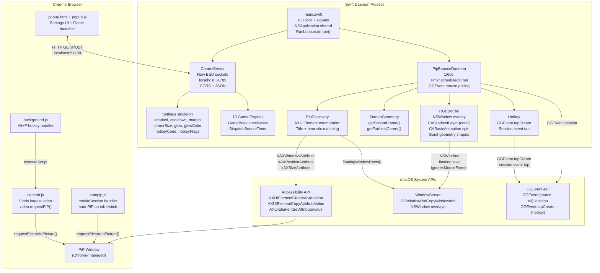
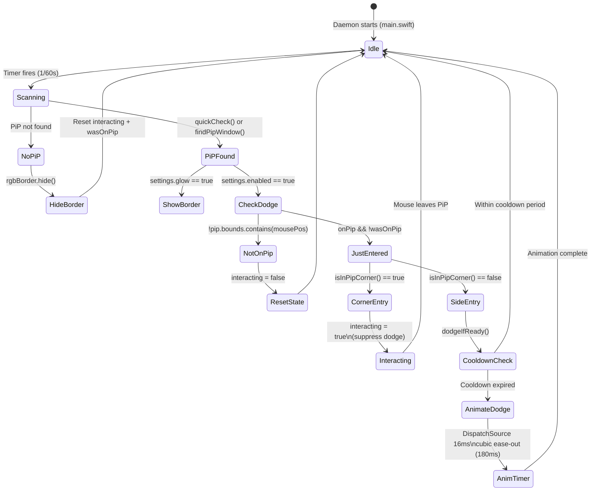
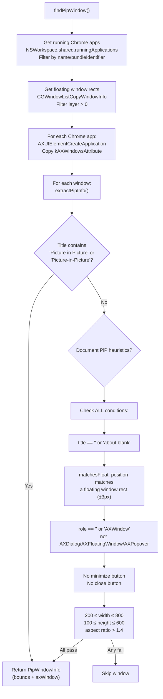
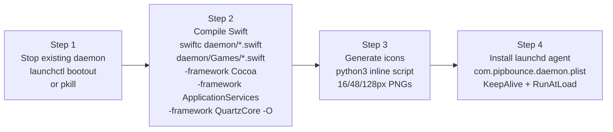
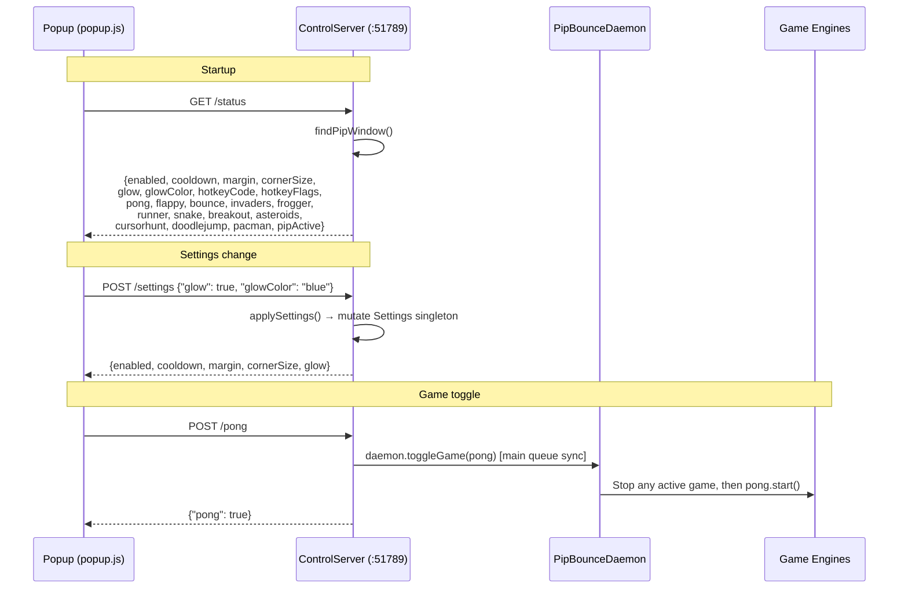
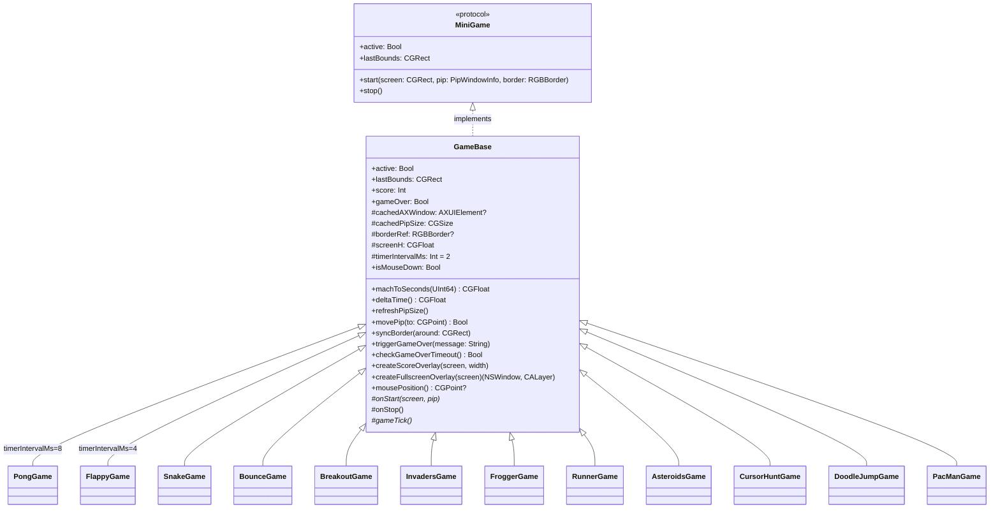
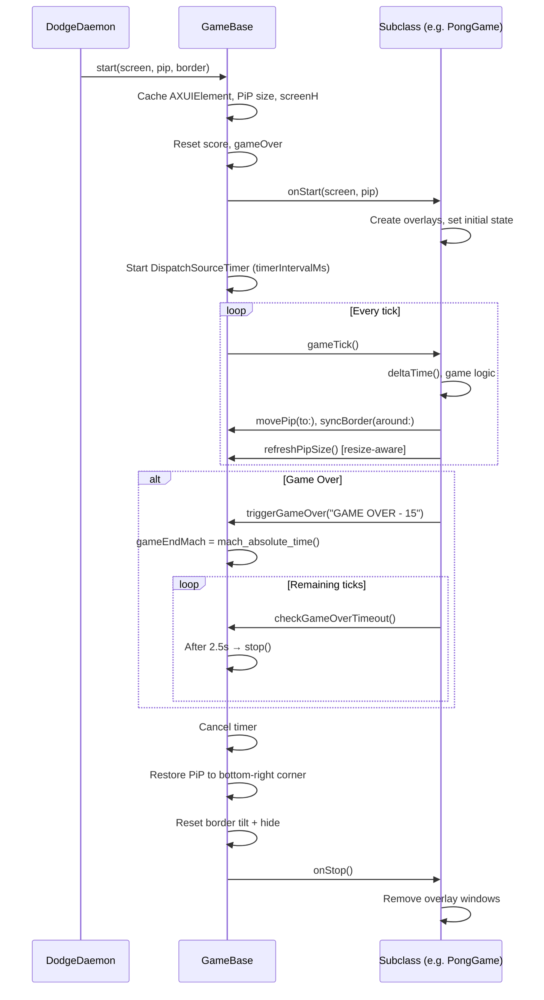
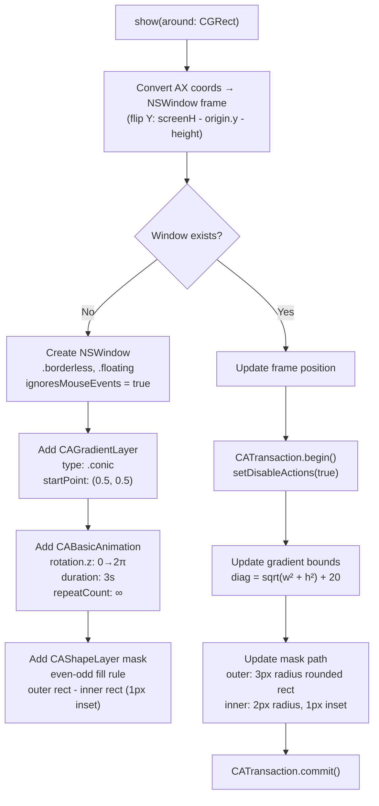
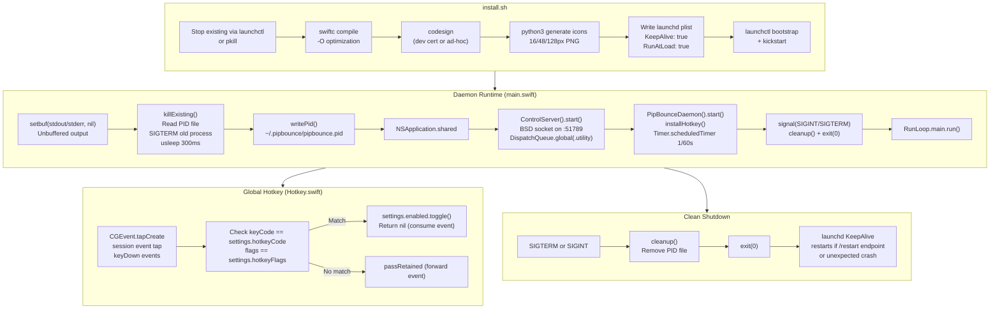

# pipbounce

**A macOS daemon + Chrome extension that makes Picture-in-Picture windows dodge your mouse cursor — and turns them into retro arcade machines.**

pipbounce watches your cursor at 60fps and flings PiP windows away when you approach from the side. Sneak in from a corner to interact with playback controls. Toggle an animated RGB glow border. Or launch one of 12 built-in mini-games (with 13 modes) that use the PiP window as a game object bouncing around your screen.

---

## Features

- **Smart dodge** — PiP jumps to the farthest screen corner on side-edge entry, but allows corner-zone interaction for playback controls
- **Animated conic gradient glow** — 1px rotating border around PiP in purple, blue, red, green, or rainbow (3s rotation cycle)
- **Sacred geometry bursts** — Triangle, hexagram, and pentagram animations triggered on game events
- **12 mini-games (13 modes)** — Pong, Flappy Bird, Snake, Bounce (physics toy + paddle mode), Breakout, Space Invaders, Frogger, Runner, Asteroids, Cursor Hunt, Doodle Jump, Pac-Man
- **Auto-PiP** — Automatically enters PiP when switching tabs via Media Session API
- **Global hotkey** — Configurable keyboard shortcut (default: Cmd+Shift+D) to toggle dodge on/off
- **Launchd integration** — Auto-starts on login with `KeepAlive: true`, logs to `~/.pipbounce/pipbounce.log`
- **Zero dependencies** — Pure Swift, compiled with `swiftc`, only system frameworks (Cocoa, ApplicationServices, QuartzCore)

---

## System Architecture



---

## Dodge Behavior



### Corner Detection Algorithm

The PiP window is divided into zones. The `isInPipCorner()` function checks if the mouse entry point falls within `cornerSize` pixels of **both** a horizontal and vertical edge simultaneously:

```
┌──────────────────────────────┐
│ CORNER │     SIDE EDGE      │ CORNER │
│  ZONE  │   (triggers dodge) │  ZONE  │
│────────│                    │────────│
│        │                    │        │
│  SIDE  │    PiP Content     │  SIDE  │
│  EDGE  │                    │  EDGE  │
│        │                    │        │
│────────│                    │────────│
│ CORNER │     SIDE EDGE      │ CORNER │
│  ZONE  │   (triggers dodge) │  ZONE  │
└──────────────────────────────┘

Corner zones = interaction allowed (no dodge)
Side edges = dodge triggered → farthest screen corner
```

`cornerSize` is clamped to at most half the PiP dimension: `min(settings.cornerSize, min(width, height) / 2)`

### Dodge Animation

When a dodge triggers, a `DispatchSourceTimer` fires every 16ms for 180ms total. Each tick:

1. Computes elapsed time via `mach_absolute_time()`
2. Applies **cubic ease-out**: `ease = 1.0 - pow(1.0 - t, 3.0)`
3. Interpolates PiP position from `animStart` to `animEnd`
4. Moves PiP via `AXUIElementSetAttributeValue(kAXPositionAttribute)`
5. Immediately syncs border overlay to match

Target corner is computed by `getFurthestCorner()`: tests all 4 screen corners (inset by `settings.margin`), picks the one whose center is farthest from the mouse (squared distance).

---

## PiP Window Detection



**Caching strategy:** The daemon caches the `AXUIElement` reference and uses `quickCheck()` (fast AX position/size read) on each tick. Full `findPipWindow()` re-scan only happens every 0.5 seconds when the cache misses.

---

## Installation

### Prerequisites

| Requirement | Why |
|-------------|-----|
| macOS | Accessibility API (`AXUIElement`), `CGEvent`, Cocoa overlays |
| Chrome / Chromium | Extension host + PiP windows |
| Xcode CLI Tools | `swiftc` compiler |
| Python 3 | Icon generation during install |

### Steps

```bash
# 1. Build and install
./install.sh
```

The installer runs 4 steps:



**Output binary:** `~/.pipbounce/pipbounce.app/Contents/MacOS/pipbounce`

**Code signing:** Uses "pipbounce Dev" certificate if found, otherwise ad-hoc (`codesign --sign -`)

```bash
# 2. Load Chrome extension
#    chrome://extensions → Developer mode → Load unpacked → select extension/

# 3. Grant Accessibility permission
#    System Settings → Privacy & Security → Accessibility
#    Add ~/.pipbounce/pipbounce.app
```

---

## Usage

### Triggering PiP

| Method | Mechanism |
|--------|-----------|
| Click extension icon | `popup.js` auto-calls `enterPip()` → `video.requestPictureInPicture()` on largest video |
| **Alt+P** | `background.js` command handler → injects `content.js` → toggles PiP |
| Switch tabs | `autopip.js` content script → `navigator.mediaSession.setActionHandler("enterpictureinpicture")` |

### Extension Popup UI

The popup (240px wide, dark zinc theme) provides:

- **Start/Stop PiP** button (context-aware label)
- **13 game mode buttons** (12 games, Bounce has 2 modes) — each POSTs to daemon, label toggles between start/stop
- **Dodge toggle** — on/off switch
- **Glow toggle** — on/off switch
- **Glow color picker** — 5 dots: purple, blue, red, green, rainbow
- **Corner zone selector** — segmented control: Small (60px), Medium (100px), Large (150px)
- **Hotkey recorder** — click to record, captures modifier+key, translates JS keyCodes to macOS virtual keycodes
- **Status indicator** — green dot "PiP active" / "Online", red dot "Offline — click to restart"

Status polls every 2 seconds via `GET /status`.

---

## Configuration

All settings are stored in the `Settings` singleton (in-memory, not persisted to disk). Changes apply instantly via HTTP API.

| Setting | Property | Default | UI Control | Description |
|---------|----------|---------|------------|-------------|
| Dodge enabled | `enabled` | `true` | Toggle switch | Master on/off for dodge behavior |
| Cooldown | `cooldown` | `0.4s` | — | Min time between consecutive dodges |
| Screen margin | `margin` | `20px` | — | Edge padding when positioning PiP after dodge |
| Corner safe zone | `cornerSize` | `100px` | Segmented: 60/100/150 | Size of each corner interaction zone |
| Glow border | `glow` | `true` | Toggle switch | Show/hide animated border overlay |
| Glow color | `glowColor` | `"purple"` | Color dot picker | Border color: purple, blue, red, green, rainbow |
| Hotkey keycode | `hotkeyCode` | `2` (D key) | Hotkey recorder | macOS virtual keycode for toggle |
| Hotkey flags | `hotkeyFlags` | `0x108` (Cmd+Shift) | Hotkey recorder | Modifier bitmask (0x100=Cmd, 0x008=Alt, 0x004=Ctrl, 0x002=Shift) |

---

## HTTP API Reference

Raw BSD socket server on `127.0.0.1:51789`. All responses are `Content-Type: application/json` with full CORS headers. OPTIONS requests return 204.

### Endpoints



| Method | Path | Request Body | Response | Notes |
|--------|------|-------------|----------|-------|
| `GET` | `/status` | — | Full state JSON (all settings + all game states + `pipActive`) | Also calls `findPipWindow()` |
| `POST` | `/toggle` | — | `{enabled: bool}` | Toggles `settings.enabled` |
| `POST` | `/settings` | JSON with any subset of settings | `{enabled, cooldown, margin, cornerSize, glow}` | Partial updates OK |
| `POST` | `/restart` | — | `{restarting: true}` | Calls `cleanup()` + `exit(0)` after 100ms; launchd restarts |
| `POST` | `/pong` | — | `{pong: bool}` | Toggle Pong game |
| `POST` | `/flappy` | — | `{flappy: bool}` | Toggle Flappy Bird |
| `POST` | `/bounce` | — | `{bounce: bool}` | Toggle Bounce (auto mode) |
| `POST` | `/bounce-paddle` | — | `{bounce: bool}` | Toggle Bounce (paddle mode — sets `bounce.paddleMode = true`) |
| `POST` | `/invaders` | — | `{invaders: bool}` | Toggle Space Invaders |
| `POST` | `/frogger` | — | `{frogger: bool}` | Toggle Frogger |
| `POST` | `/runner` | — | `{runner: bool}` | Toggle Runner |
| `POST` | `/snake` | — | `{snake: bool}` | Toggle Snake |
| `POST` | `/breakout` | — | `{breakout: bool}` | Toggle Breakout |
| `POST` | `/asteroids` | — | `{asteroids: bool}` | Toggle Asteroids |
| `POST` | `/cursorhunt` | — | `{cursorhunt: bool}` | Toggle Cursor Hunt |
| `POST` | `/doodlejump` | — | `{doodlejump: bool}` | Toggle Doodle Jump |
| `POST` | `/pacman` | — | `{pacman: bool}` | Toggle Pac-Man |

All game endpoints dispatch to main queue synchronously via `DispatchSemaphore` and call `daemon.toggleGame()`, which stops any running game before starting the requested one.

---

## Mini-Games

### Game Engine Architecture



**Key design:** Each game file declares a **global singleton** (e.g., `let pong = PongGame()`) referenced by `ControlServer` and `DodgeDaemon`. The daemon's tick loop bails immediately when any game is active — games own the PiP position entirely during gameplay.

### GameBase Lifecycle



### Game Details

| Game | Singleton | Timer | Controls | Key Mechanics |
|------|-----------|-------|----------|---------------|
| **Pong** | `pong` | 8ms | Mouse Y = paddle | PiP = ball, AI opponent (150ms reaction delay + noise), rally speed ramp 420→900 px/s over 15s, ball trail (3 ghost layers at 0.6/0.3/0.15 opacity), screen shake on score, match: first to 7 win by 2 |
| **Flappy Bird** | `flappy` | 4ms | Click = flap | PiP resized to 200×112, gravity=900 flapImpulse=-360, green pipe NSWindows (body 56px + cap 70×28px), border tilts with velocity via `rotationPadding`, pipeGap = pipHeight + 160, best score tracking |
| **Snake** | `snake` | 2ms | Mouse = steer, click = boost | Cursor-following head (maxTurnRate 6 rad/s), distance-based tail tracking (sampled every 6px), 3× screen world with smooth camera lerp (0.08), click = 2× speed for 0.3s (2s cooldown), tail grows on food |
| **Bounce** | `bounce` | 2ms | Click-drag = grab & throw | Physics toy: gravity (120), elasticity (0.9), air friction (0.9993), throw velocity from position history, border tilts with movement, rest detection at 3 px/s |
| **Bounce Paddle** | `bounce` | 2ms | Automatic (AI plays) | Same physics + AI paddle on farthest screen edge (80×6px, gradient shimmer), scores on paddle hits, paddle teleports to opposite edge on hit, sacred geometry bursts at 20/50/100 (tier 1/2/3), vibrancy score overlay |
| **Breakout** | `breakout` | 8ms | Mouse X = paddle, click = launch | 10×5 brick grid (5 color rows, top 2 rows = 2 hits), row scoring 50/40/30/20/10, 3 lives (♥), extra lives at 500/1500 pts, levels (paddle shrinks 20px/level, min 80px, speed +10%/level), CAEmitterLayer particle burst on brick death, paddle flash + spring bounce on hit |
| **Space Invaders** | `invaders` | 8ms | Mouse X = ship, hold = rapid fire (4/sec) | 8×5 grid with 11×8 pixel-art bitmap sprites (squid/crab/skull), 5 row colors, mystery UFO (random 50/100/150/300 pts, spawns every 20-30s), wave system (speed ×1.15, shot interval ×0.85 per wave), 3 lives with 1.5s invulnerability blink, explosion particles + floating score pops, max 3 simultaneous player bullets |
| **Frogger** | `frogger` | 8ms | Mouse X = position, L-click = hop forward, R-click = hop back | 8 lanes (0=safe start, 1-6=traffic, 7=goal), 3 vehicle types: motorcycle (fast, narrow), car (medium), truck (slow, wide) with detailed CALayer graphics (wheels, headlights, windshield), near-miss detection (8px threshold), death shake animation (8px amp, 30Hz), speed +15 px/s per crossing, lane backgrounds + dashed center lines |
| **Runner** | `runner` | 8ms | Mouse Y = vertical position | Side-scrolling gap dodger: obstacles with moving gaps (sinusoidal oscillation) scroll left at 200→600 px/s, zone system every ~10 obstacles with zone announcement pause, zone-colored obstacles (grey→steel→purple→brown→forest→crimson), gap glow indicators, death particles |
| **Asteroids** | `asteroids` | 2ms | Mouse = aim (ship thrusts toward), hold = auto-fire | 3× screen world with camera lerp (0.08), thrust physics (400 accel, drift half-life 0.5s), 3 asteroid sizes (large r=25/20pts → medium r=15/50pts → small r=8/100pts), large splits into 2 medium, medium into 2 small, wave system with 1.5s pause, 3 lives + 2s invulnerability, CAEmitterLayer for explosions + thrust trail + ambient space dust, 5 max bullets with 2s lifetime |
| **Cursor Hunt** | `cursorhunt` | 2ms | Move mouse to survive | PiP **chases your cursor** — accelerates toward mouse (400 + 40×time px/s²), max speed ramps (500 + 40×time, cap 1600), friction 0.985, score = survival time in seconds, game over = PiP catches cursor (8px inset hitbox), border tilts with velocity |
| **Doodle Jump** | `doodlejump` | 2ms | Mouse X = horizontal | PiP bounces on platforms (impulse -520, strong -620), gravity 900, camera scrolls up as player reaches new heights, static platforms (green) + moving platforms (brown), platform width = 1.4× PiP width, spacing increases with height, game over = fall below camera |
| **Pac-Man** | `pacman` | 8ms | Mouse = direction | 21×21 maze (hardcoded template), 4 ghosts (red/pink/cyan/orange) with CAShapeLayer bodies + animated eye pupils, power pellets = 6s scared mode (ghosts turn blue, score doubles per ghost: 200→400→800→1600), tunnel wrapping on row 8, camera follows player through world, frosted glass NSWindow overlay, 3 lives, win = all dots collected |

### Rendering

All game graphics use **fullscreen NSWindow overlays** created via `GameBase.createFullscreenOverlay()`:
- `NSWindow` with `.borderless` style, `.floating` level
- `backgroundColor = .clear`, `isOpaque = false`
- `ignoresMouseEvents = true` — cursor passes through
- `collectionBehavior = [.canJoinAllSpaces, .stationary, .transient, .ignoresCycle]`
- Graphics rendered via `CALayer` tree on the content view

Score overlay: separate 160x44 `NSWindow` centered at screen top, black 60% alpha background, 24pt mono bold white text.

---

## RGB Glow Border

The border is a separate `NSWindow` that tracks the PiP position.

### Rendering Pipeline



### Color Sets

| Color | Gradient Stops |
|-------|---------------|
| Purple | Violet → Pink → Deep Purple → Lavender |
| Blue | Royal Blue → Cyan → Steel Blue → Deep Blue |
| Red | Red → Coral → Crimson → Dark Red |
| Green | Emerald → Mint → Forest → Lime |
| Rainbow | Red → Yellow → Green → Cyan → Blue → Magenta → Red |

### Burst Geometry

`burstGeometry(tier:around:)` creates animated sacred geometry shapes:

| Tier | Shape | Animation |
|------|-------|-----------|
| 1 | Triangle (3-sided polygon) | Spin 0→2π, scale 0.3→1.5, fade out, 2s |
| 2 | Hexagram (two overlapping triangles) | Spin 0→2π, scale 0.3→1.5, fade out, 2s |
| 3+ | Pentagram with circle | Spin 0→4π, scale 0.3→1.5, fade out, 2s |

Shapes are drawn as `CAShapeLayer` sublayers using the current glow color, cleaned up after 2.1s.

### Tilt

`tilt(_ angle: CGFloat)` applies `CATransform3DMakeRotation` to the container layer. Used by Flappy Bird to wobble the border based on vertical velocity. Requires `rotationPadding > 0` for headroom.

---

## Process Lifecycle



---

## Project Structure

```
pipbounce/
├── install.sh                          # 4-step build + install + launchd setup
├── README.md
├── extension/                          # Chrome MV3 Extension
│   ├── manifest.json                   # v1.4, permissions: scripting, activeTab, tabs
│   ├── popup.html                      # 240px dark zinc UI, all controls
│   ├── popup.js                        # Settings controller, game toggles, status polling (2s)
│   ├── background.js                   # Alt+P command → injects content.js
│   ├── content.js                      # Find largest video → toggle PiP
│   ├── autopip.js                      # Content script (all pages) → mediaSession auto-PiP
│   └── icons/                          # Generated PNGs (16/48/128px)
└── daemon/                             # Swift source (compiled by swiftc)
    ├── main.swift                      # Entry: PID lock, signals, NSApplication, RunLoop
    ├── DodgeDaemon.swift               # 1/60s tick, CGEvent mouse, dodge + animate
    ├── ControlServer.swift             # BSD socket HTTP on :51789, route dispatch
    ├── PipDiscovery.swift              # AXUIElement + CGWindowList PiP detection
    ├── ScreenGeometry.swift            # Screen frame + farthest corner math
    ├── Settings.swift                  # Config singleton (in-memory, not persisted)
    ├── Hotkey.swift                    # CGEvent tap for global hotkey
    ├── RGBBorder.swift                 # Conic gradient border + burst geometry
    ├── MiniGame.swift                  # Protocol: active, lastBounds, start(), stop()
    └── Games/
        ├── GameBase.swift              # Abstract base: Mach timing, DispatchSourceTimer, score overlay, PiP restore
        ├── PongGame.swift              # AI opponent, rally speed ramp, ball trail, screen shake, first-to-7
        ├── FlappyGame.swift            # Gravity + flap, green pipe NSWindows, PiP resize to 200×112, border tilt
        ├── SnakeGame.swift             # Cursor-following head, 3× world + camera, distance-based tail, click boost
        ├── BounceGame.swift            # Physics toy (drag/throw) + AI paddle mode, burst geometry milestones
        ├── BreakoutGame.swift          # 10×5 bricks (2-hit top rows), lives, levels, CAEmitterLayer particles
        ├── InvadersGame.swift          # 11×8 pixel-art sprites, mystery UFO, wave system, rapid fire, score pops
        ├── FroggerGame.swift           # 8 lanes, 3 vehicle types with detailed graphics, hop forward/back, near-miss
        ├── RunnerGame.swift            # Side-scrolling gap dodger, zone system, moving gaps, death particles
        ├── AsteroidsGame.swift         # 3× world, thrust/drift physics, 3 asteroid sizes, auto-fire, emitter FX
        ├── CursorHuntGame.swift        # PiP chases cursor with ramping acceleration, survive as long as possible
        ├── DoodleJumpGame.swift        # Platform bouncing, camera scroll, static + moving platforms
        └── PacManGame.swift            # 21×21 maze, 4 ghosts with eyes, power pellets, tunnel wrap, glass overlay
```

---

## Troubleshooting

| Problem | Cause | Solution |
|---------|-------|----------|
| "Accessibility permission required" | Daemon can't access AXUIElement | System Settings → Privacy & Security → Accessibility → add `~/.pipbounce/pipbounce.app` (or terminal app) |
| PiP window not detected | Title doesn't match, or Document PiP fails heuristics | Ensure Chrome PiP is active. Document PiP must be: untitled, floating layer, no minimize/close buttons, 200-800px wide, aspect > 1.4 |
| Extension says "Offline" | Daemon not running or port 51789 in use | Check `launchctl list com.pipbounce.daemon`, or run `~/.pipbounce/pipbounce.app/Contents/MacOS/pipbounce` manually |
| Game overlays not visible | Missing Screen Recording permission | System Settings → Privacy & Security → Screen Recording → add the app |
| Build fails | Missing swiftc or python3 | Run `xcode-select --install`, ensure `python3` is in PATH |
| Hotkey not working | CGEvent tap not enabled | Grant Accessibility permission; restart daemon |
| Settings lost on restart | Settings are in-memory only | Expected behavior — settings reset to defaults on daemon restart |
| Daemon won't start (port busy) | Previous instance didn't clean up | Check `lsof -i :51789`, kill stale process, or delete `~/.pipbounce/pipbounce.pid` |

---

## License

MIT
