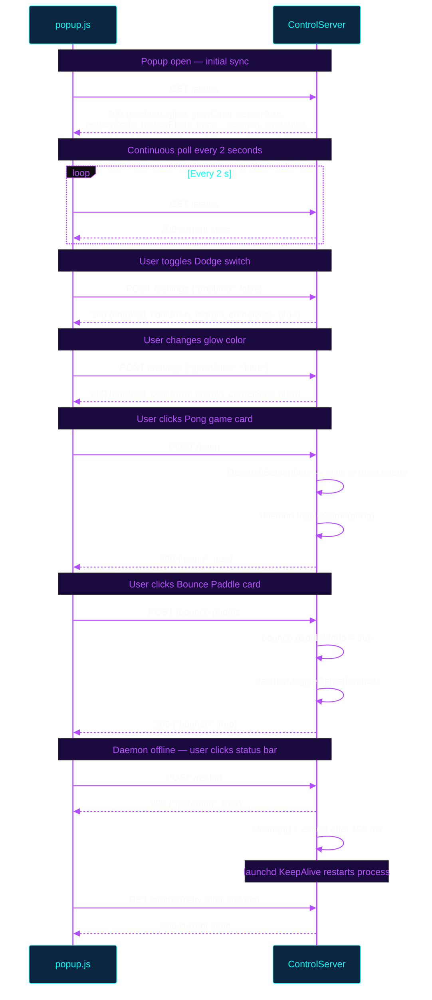
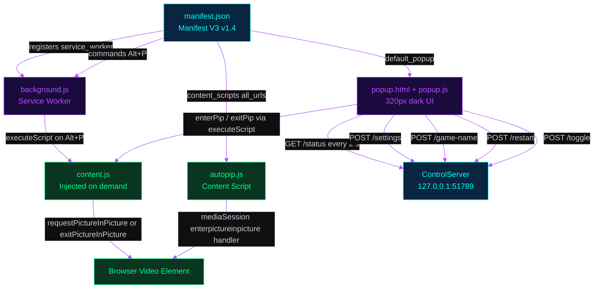
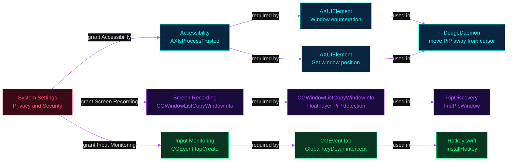

# API Reference

This document covers the complete XPip API surface: the HTTP control server exposed by the daemon, the Chrome extension architecture, the full configuration model, the macOS permission requirements, and common troubleshooting scenarios. It is intended for developers integrating with XPip or building tooling on top of it.

---

## HTTP API

The daemon runs a raw BSD socket HTTP server bound exclusively to `127.0.0.1:51789`. There is no TLS, no authentication, and no external network exposure — the server is localhost-only by design. Every successful response carries `Content-Type: application/json`. All endpoints emit a full CORS header block:

```
Access-Control-Allow-Origin: *
Access-Control-Allow-Methods: GET, POST, OPTIONS
Access-Control-Allow-Headers: Content-Type
```

Preflight `OPTIONS` requests receive a `204 No Content` response with those headers and no body. Unrecognised routes receive a `404 Not Found` response with a body of `{}`.

The server processes one client connection at a time on a background `DispatchQueue` with `.utility` quality-of-service. Game toggle endpoints synchronise back to the main run loop via `DispatchSemaphore` before returning, ensuring thread-safe access to game state.

---

## API Communication Flow

The sequence below shows how the Chrome extension popup interacts with the control server during a typical session. Status is polled continuously; settings changes and game toggles are fire-and-confirm operations that return the new state immediately.



---

## Endpoint Reference

The table below documents every endpoint. Request bodies must be JSON; the `Content-Type: application/json` header is not required by the server but is sent by the extension for all `POST /settings` calls. Boolean game states report the post-toggle value.

| Method | Path | Request Body | Response Body | Notes |
|--------|------|-------------|--------------|-------|
| `GET` | `/status` | — | Full state object (see below) | Also calls `findPipWindow()` to detect active PiP. Returns `pipActive: bool`. |
| `POST` | `/toggle` | — | `{"enabled": bool}` | Toggles `settings.enabled` in-place. |
| `POST` | `/settings` | Partial settings object | `{"enabled", "cooldown", "margin", "cornerSize", "glow"}` | Accepts any subset of the eight settings keys. Unknown keys are silently ignored. |
| `POST` | `/restart` | — | `{"restarting": true}` | Schedules `cleanup()` + `exit(0)` 100 ms after response. launchd `KeepAlive` restarts the process. |
| `POST` | `/pong` | — | `{"pong": bool}` | Dispatches `toggleGame(pong)` on main queue via semaphore. |
| `POST` | `/flappy` | — | `{"flappy": bool}` | Dispatches `toggleGame(flappy)` on main queue. |
| `POST` | `/bounce` | — | `{"bounce": bool}` | Sets `bounce.paddleMode = false`, then dispatches `toggleGame(bounce)`. |
| `POST` | `/bounce-paddle` | — | `{"bounce": bool}` | Sets `bounce.paddleMode = true`, then dispatches `toggleGame(bounce)`. Both `/bounce` and `/bounce-paddle` return the key `"bounce"`. |
| `POST` | `/invaders` | — | `{"invaders": bool}` | Dispatches `toggleGame(invaders)` on main queue. |
| `POST` | `/frogger` | — | `{"frogger": bool}` | Dispatches `toggleGame(frogger)` on main queue. |
| `POST` | `/runner` | — | `{"runner": bool}` | Dispatches `toggleGame(runner)` on main queue. |
| `POST` | `/snake` | — | `{"snake": bool}` | Dispatches `toggleGame(snake)` on main queue. |
| `POST` | `/breakout` | — | `{"breakout": bool}` | Dispatches `toggleGame(breakout)` on main queue. |
| `POST` | `/asteroids` | — | `{"asteroids": bool}` | Dispatches `toggleGame(asteroids)` on main queue. |
| `POST` | `/cursorhunt` | — | `{"cursorhunt": bool}` | Dispatches `toggleGame(cursorhunt)` on main queue. |
| `POST` | `/doodlejump` | — | `{"doodlejump": bool}` | Dispatches `toggleGame(doodlejump)` on main queue. |
| `POST` | `/pacman` | — | `{"pacman": bool}` | Dispatches `toggleGame(pacman)` on main queue. |

### GET /status — Full Response Schema

```json
{
  "enabled":     true,
  "cooldown":    0.4,
  "margin":      20,
  "cornerSize":  100,
  "glow":        true,
  "glowColor":   "purple",
  "hotkeyCode":  2,
  "hotkeyFlags": 264,
  "pong":        false,
  "flappy":      false,
  "bounce":      false,
  "invaders":    false,
  "frogger":     false,
  "runner":      false,
  "snake":       false,
  "breakout":    false,
  "asteroids":   false,
  "cursorhunt":  false,
  "doodlejump":  false,
  "pacman":      false,
  "pipActive":   true
}
```

All twelve game keys are always present in the response regardless of which games are installed. `pipActive` reflects whether `findPipWindow()` located a floating Picture-in-Picture window at the moment of the request.

---

## Chrome Extension Architecture

The extension is a Manifest V3 Chrome extension. It coordinates three separate execution contexts — a background service worker, injected content scripts, and the popup UI — to manage PiP entry/exit and communicate with the daemon. The popup is the sole consumer of the HTTP API; the service worker and content scripts operate entirely within the browser's sandboxed JavaScript environment.



### manifest.json

The manifest declares Manifest Version 3 with three runtime permissions:

- `scripting` — required for `chrome.scripting.executeScript`, used by both the background worker and the popup to inject PiP control code into page frames.
- `activeTab` — grants temporary access to the currently focused tab when the popup is open or the keyboard command fires.
- `tabs` — used to query `chrome.tabs.query({ active: true, currentWindow: true })` for the current tab ID.

`host_permissions: ["<all_urls>"]` is declared to allow content script injection on any origin. The `toggle-pip` command is bound to `Alt+P` (Mac and default).

### background.js

The service worker listens for the `toggle-pip` command. When `Alt+P` is pressed, it queries the active tab and uses `chrome.scripting.executeScript` to inject `content.js` into all frames of that tab. The service worker itself performs no HTTP requests and holds no state.

### content.js

An immediately-invoked function expression injected on demand. It queries all `<video>` elements in the current frame, filters for those with `readyState > 0` and `disablePictureInPicture !== true`, and selects the largest by pixel area. If the selected video is already the `document.pictureInPictureElement` it calls `exitPictureInPicture()`; otherwise it calls `video.requestPictureInPicture()`. This script is injected fresh on each hotkey press and runs across `allFrames`.

### autopip.js

A persistent content script injected at `document_idle` on every page load across all frames. It registers a `navigator.mediaSession` action handler for the `"enterpictureinpicture"` event. When the browser fires this event (typically when the user switches away from a tab with a playing video), the handler selects the largest non-paused video and calls `requestPictureInPicture()`. This provides automatic PiP entry on tab switch without any user interaction.

### popup.html / popup.js

The popup is a 320-pixel-wide dark UI (background `#0f0f11`, zinc colour palette). On open, `init()` polls `GET /status`. If the daemon is online and no PiP window is active, `enterPip()` is called automatically to enter PiP before showing controls.

The UI provides:

- **Start/Stop PiP button** — calls `enterPip()` or `exitPip()` depending on the `pipActive` flag returned by the last status poll.
- **13 game mode cards** — a 2-column grid. Each card posts to the corresponding game endpoint and toggles between its label and stop-label states. Clicking any game card also calls `enterPip()` first if no PiP is active.
- **Settings panel** (collapsible) containing:
  - **Dodge toggle** — checkbox posting `{enabled: bool}` to `/settings`.
  - **Glow toggle** — checkbox posting `{glow: bool}` to `/settings`.
  - **Glow color picker** — five dots (purple, blue, red, green, rainbow) posting `{glowColor: string}` to `/settings` and updating the CSS `--accent` and `--accent-glow` variables.
  - **Toggle hotkey recorder** — click to arm recording; the next key combination (modifier required) is translated from JS `keyCode` to macOS virtual keycode via a static lookup table and posted as `{hotkeyCode, hotkeyFlags}` to `/settings`.
  - **Corner zone segmented control** — three options (Small 60, Medium 100, Large 150) posting `{cornerSize: number}` to `/settings`.
- **Status bar** — displays a green dot with "PiP active" or "Online" when the daemon responds, and a red dot with "Offline — click to restart" otherwise. Clicking while offline posts to `/restart`.

Status is refreshed by `setInterval(fetchStatus, 2000)` running continuously while the popup is open.

---

## Configuration Reference

All settings are held in a single `Settings` instance (`let settings = Settings()`) allocated at daemon startup. Settings are **in-memory only** — they are not written to disk and reset to defaults on every restart. The `POST /settings` endpoint accepts any subset of these keys in a single JSON object.

| Setting | JSON Key | Swift Type | Default | UI Control | Description |
|---------|----------|-----------|---------|------------|-------------|
| Dodge enabled | `enabled` | `Bool` | `true` | Dodge toggle switch | Master on/off for the dodge behaviour. Can also be toggled via `POST /toggle` or the global hotkey. |
| Dodge cooldown | `cooldown` | `TimeInterval` (Double) | `0.4` | — (no UI) | Minimum seconds between consecutive dodge moves. Prevents thrashing when the cursor dwells near the PiP window. |
| Dodge margin | `margin` | `CGFloat` | `20` | — (no UI) | Additional padding in points added around the cursor hit area before a dodge is triggered. |
| Corner zone size | `cornerSize` | `CGFloat` | `100` | Corner zone segmented control | Side length in points of the square snap zones in each screen corner. Values: 60 (Small), 100 (Medium), 150 (Large). |
| Glow enabled | `glow` | `Bool` | `true` | Glow toggle switch | Enables the RGB border glow effect on the PiP window. |
| Glow color | `glowColor` | `String` | `"purple"` | Glow color picker | Named color for the border effect. Accepted values: `purple`, `blue`, `red`, `green`, `rainbow`. |
| Hotkey keycode | `hotkeyCode` | `UInt16` | `2` (D key) | Hotkey recorder | macOS Carbon virtual keycode for the dodge toggle hotkey. |
| Hotkey modifier flags | `hotkeyFlags` | `UInt32` | `0x108` (Cmd+Shift) | Hotkey recorder | Bitmask of modifier keys: `0x100` = Cmd, `0x008` = Option, `0x004` = Control, `0x002` = Shift. Combined with bitwise OR. |

### Hotkey Flag Bitmask

The `hotkeyFlags` value uses the upper 12 bits of `CGEventFlags` after a right-shift of 16:

| Modifier | Bit mask |
|----------|----------|
| Cmd | `0x100` |
| Option | `0x008` |
| Control | `0x004` |
| Shift | `0x002` |

The default `0x108` equals `0x100 | 0x008`, meaning Cmd+Option. The popup UI displays this as `⌘⌥D`. A combination must include at least one modifier; bare key presses are rejected by the hotkey recorder.

---

## Permission Model

The daemon requires three macOS privacy permissions to function. None are requested automatically — they must be granted manually in System Settings before the daemon starts, or the relevant subsystem silently fails.

The diagram below shows which system calls require each permission and where they are used.



### Granting Permissions

Navigate to **System Settings → Privacy & Security** and add `XPip` (located at `~/.xpip/xpip.app` after install) to each of the three categories:

1. **Accessibility** — Required for `AXUIElement` window enumeration and position setting. The daemon checks `AXIsProcessTrusted()` on startup and logs a warning if this permission is absent. Without it the window cannot be moved.

2. **Screen Recording** — Required for `CGWindowListCopyWindowInfo` with `kCGWindowListOptionAll`. This is how `findPipWindow()` identifies floating PiP windows by their layer and ownership properties. Without it, the daemon cannot detect whether a PiP window exists.

3. **Input Monitoring** — Required for `CGEvent.tapCreate` at `cgSessionEventTap`. The event tap intercepts `keyDown` events system-wide to implement the global dodge toggle hotkey. Without it, `installHotkey()` fails silently and the hotkey does not work.

After granting permissions, restart the daemon for them to take effect.

---

## Troubleshooting

| Symptom | Likely Cause | Resolution |
|---------|-------------|-----------|
| PiP window does not move away from cursor | Accessibility permission not granted | System Settings → Privacy & Security → Accessibility → add `XPip` |
| Status bar shows "Offline" immediately after install | Daemon not running or launchd plist not loaded | Run `launchctl load ~/Library/LaunchAgents/com.xpip.daemon.plist` or re-run `install.sh` |
| Hotkey does not respond | Input Monitoring permission not granted | System Settings → Privacy & Security → Input Monitoring → add `XPip` |
| `GET /status` returns `pipActive: false` even with a PiP window open | Screen Recording permission not granted | System Settings → Privacy & Security → Screen Recording → add `XPip` |
| `POST /settings` returns 404 | Request path has trailing slash or typo | Ensure path is exactly `/settings` with no trailing slash |
| Game does not start; popup button stays in idle state | PiP window not open when game POST is sent | The popup calls `enterPip()` before the game POST; confirm the active tab has a playable video element |
| Settings reset after restarting daemon | Settings are in-memory only by design | Settings are not persisted; re-apply via `POST /settings` or the popup UI after each restart |
| Alt+P hotkey does not enter PiP | Extension shortcut may be overridden by another extension | Navigate to `chrome://extensions/shortcuts` and reassign the `toggle-pip` command for XPip |
| `autopip.js` does not enter PiP on tab switch | Page video has `disablePictureInPicture` attribute or is paused | The auto-PiP handler only selects non-paused videos without the `disablePictureInPicture` attribute; no workaround without page-level change |
| Daemon restarts but settings differ from before | Expected: settings reset on restart | All settings are defaults after restart; apply desired configuration via `POST /settings` |
| `bounce-paddle` and `bounce` both map to `"bounce"` key in response | By design — they share the same game instance | Use the `bounce` field in the response to read state for both variants |
