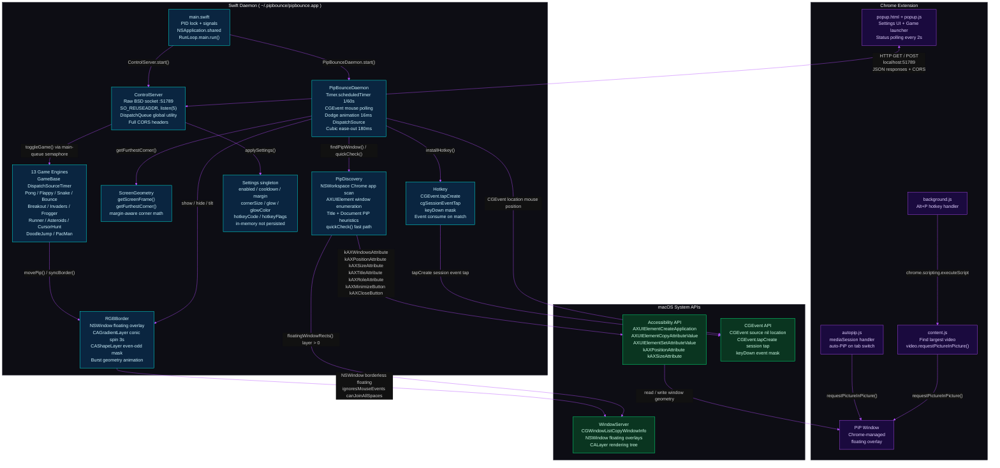
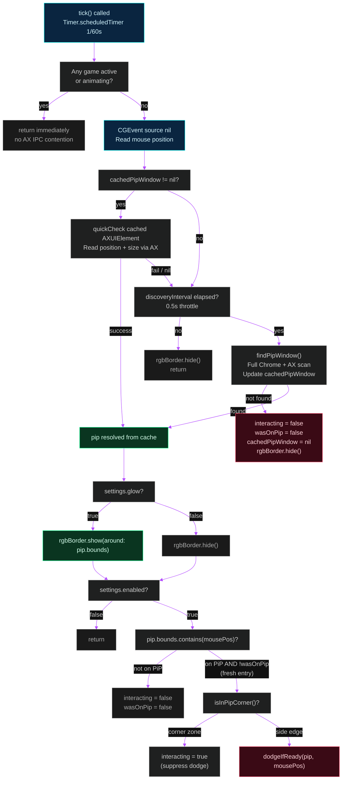
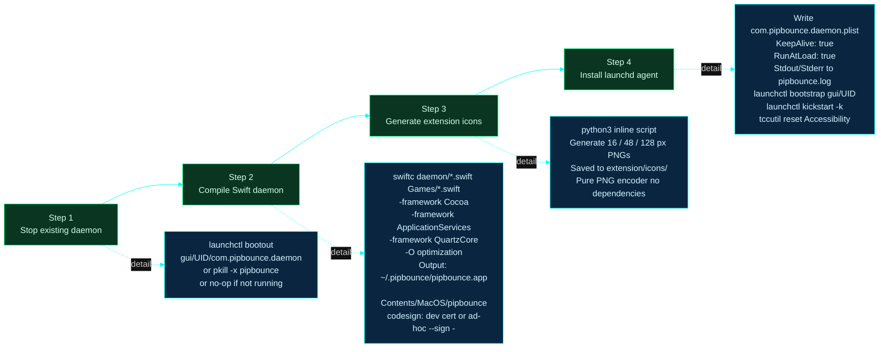
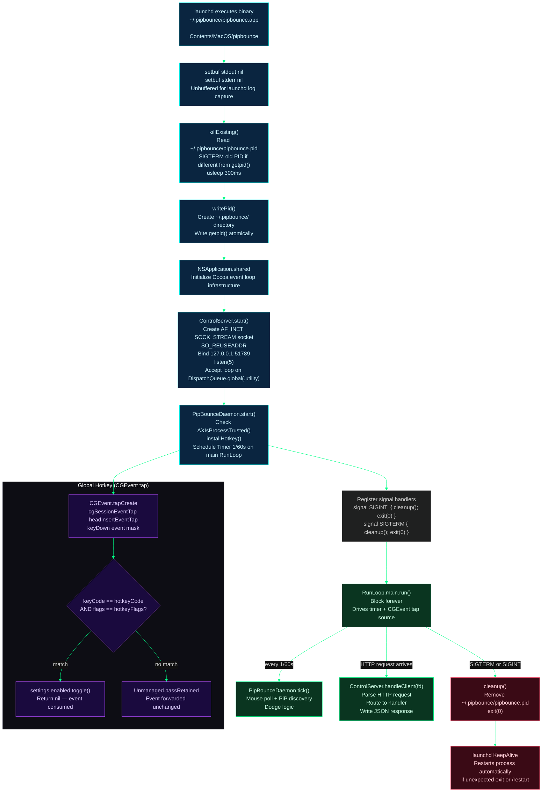

# pipbounce — Architecture

 

pipbounce is a macOS background daemon plus a Chrome extension that makes Picture-in-Picture windows dodge the mouse cursor and doubles as a retro arcade platform. This document covers the overall system architecture, daemon internals, and process lifecycle. For detailed treatment of the dodge algorithm and PiP detection see [DODGE-SYSTEM.md](./DODGE-SYSTEM.md); for the game engine and all thirteen game modes see [GAME-ENGINE.md](./GAME-ENGINE.md); for the glow border and sacred geometry burst system see [RGB-BORDER.md](./RGB-BORDER.md); for the HTTP API see [API-REFERENCE.md](./API-REFERENCE.md).

---

## Diagram color legend

All Mermaid diagrams in this documentation follow a consistent color system:

| Color | Hex | Meaning |
|-------|-----|---------|
| Cyan | `#00fff5` | Data flow / discovery / polling |
| Purple | `#b44dff` | UI / rendering / overlays |
| Green | `#00ff88` | System / lifecycle / infrastructure |
| Red | `#ff4d6d` | Events / actions / mutations |

---

## System Architecture Overview

pipbounce is organized into three cooperating layers that span two processes and the macOS kernel:

1. **Chrome Extension** — A Manifest V3 extension running inside Chrome. It provides the user-visible popup UI and issues commands to the daemon over localhost HTTP. It also injects content scripts that interact with the browser's Picture-in-Picture API to enter and exit PiP mode.

2. **Swift Daemon** — A native macOS process compiled with `swiftc` and managed by `launchd`. It runs a raw BSD socket HTTP server on port 51789, polls the mouse position at 60 fps, discovers PiP windows through the Accessibility API, animates dodges, renders an always-on-top gradient border, and drives thirteen mini-game engines.

3. **macOS System APIs** — The daemon relies on three kernel-level subsystems: the Accessibility API (`AXUIElement`) for reading and writing PiP window geometry, the CGEvent API for global mouse polling and keyboard event tapping, and the WindowServer (`CGWindowList` + `NSWindow`) for floating overlay windows.

The diagram below shows every significant component in all three layers and the connections between them. Arrows are labeled with the mechanism or data type they carry.



### Key architectural decisions

**No Xcode project.** The daemon is compiled with a single `swiftc` invocation during `./install.sh`. All source files are passed directly on the command line. This keeps the build reproducible without a developer account or project file.

**Raw BSD sockets.** `ControlServer` opens a TCP socket with `socket(AF_INET, SOCK_STREAM, 0)` and handles HTTP with basic string parsing. This avoids the need for Vapor, NIO, or any third-party HTTP library while remaining compatible with the browser's `fetch()` API through explicit CORS headers.

**Global singletons for all subsystems.** `settings`, `pong`, `flappy`, `bounce`, and the other game instances are file-scope `let` constants visible across the entire daemon. This is intentional: `ControlServer` and `DodgeDaemon` must reference the same game objects, and Swift's module system guarantees these constants are initialized exactly once before `main.swift` runs.

**Accessibility API for PiP control.** The daemon moves and reads PiP windows through `AXUIElement` rather than private window-server APIs. This is the only officially supported way for a third-party process to reposition another application's window on macOS, at the cost of requiring the Accessibility permission.

---

## Daemon Internals

### Bootstrap sequence

`main.swift` is the entry point. It runs synchronously from top to bottom before handing control to `RunLoop.main.run()`. The order of operations matters: stdio is made unbuffered first so that `launchd` captures log output immediately, then any pre-existing daemon instance is stopped, then the process registers itself, and only then are the subsystems started.

```
setbuf(stdout, nil)       — unbuffered stdout for launchd log capture
setbuf(stderr, nil)       — unbuffered stderr

killExisting()            — read ~/.pipbounce/pipbounce.pid
                          — SIGTERM the old PID
                          — usleep(300_000) — give it 300ms to exit

writePid()                — create ~/.pipbounce/ if needed
                          — write getpid() to the PID file

NSApplication.shared      — initialize Cocoa run loop infrastructure

ControlServer().start()   — bind :51789, start accept loop on global(.utility)
PipBounceDaemon().start() — installHotkey() + schedule 1/60s timer

signal(SIGINT)  { cleanup(); exit(0) }
signal(SIGTERM) { cleanup(); exit(0) }

RunLoop.main.run()        — block forever, dispatching timers and events
```

`NSApplication.shared` is required even though pipbounce is a background daemon (it has `LSUIElement = true` in its `Info.plist`). Cocoa's window and timer machinery depends on the application object being initialized. The `RunLoop.main.run()` call at the end drives both the 60 fps timer and the CGEvent tap source.

### The 1/60s tick loop

`PipBounceDaemon.start()` schedules a `Timer.scheduledTimer` with interval `1/60.0` seconds on the main run loop. Every tick calls `PipBounceDaemon.tick()`, which is the central coordinator for the dodge behavior.

The tick immediately bails out if any game engine is active or a dodge animation is in progress. This is a deliberate design: game engines own their own `DispatchSourceTimer` at their preferred intervals (2 ms for physics-heavy games, 8 ms for turn-based ones), so the 60 fps timer would be redundant and would contend for the AX API during gameplay.

When no game is active, the tick polls the mouse position with `CGEvent(source: nil).location`, then resolves the PiP window through a two-tier cache:

1. **Fast path** — If `cachedPipWindow` holds an `AXUIElement` from a previous successful scan, `quickCheck()` reads its current position and size in a single AX roundtrip. If that succeeds the cache is considered valid.
2. **Slow path** — If the fast path fails (the window closed, moved processes, or was never found), a full `findPipWindow()` re-scan is triggered, but no more than once every 500 ms (`discoveryInterval`). This prevents the AX API from being hammered when no PiP is open.

The diagram below shows the full decision tree inside a single tick:



### Subsystem responsibilities

The daemon is composed of eight cooperating subsystems. The table below summarizes what each one owns and how it communicates with others.

| Subsystem | File | Owns | Communicates via |
|-----------|------|------|-----------------|
| `main.swift` | `main.swift` | PID lifecycle, signal handlers, startup order | Direct calls at boot |
| `ControlServer` | `ControlServer.swift` | HTTP server socket, request routing | Reads/writes `settings` singleton; dispatches to `daemon.toggleGame()` via main-queue semaphore |
| `PipBounceDaemon` | `DodgeDaemon.swift` | 60 fps tick, dodge animation, game coordinator | Calls `findPipWindow()`, `quickCheck()`, `getFurthestCorner()`, `rgbBorder` methods |
| `PipDiscovery` | `PipDiscovery.swift` | PiP window detection logic | Returns `PipWindowInfo`; calls AX API and `CGWindowListCopyWindowInfo` |
| `ScreenGeometry` | `ScreenGeometry.swift` | Screen frame conversion, corner math | Pure functions, no shared state |
| `Hotkey` | `Hotkey.swift` | Global keyboard event tap | Mutates `settings.enabled` directly |
| `RGBBorder` | `RGBBorder.swift` | Floating overlay NSWindow, CALayer rendering, burst geometry | Called by `PipBounceDaemon` and game engines |
| `Settings` | `Settings.swift` | All runtime configuration | Global `let settings = Settings()` instance |

### Dodge animation

When `dodgeIfReady()` determines a dodge should fire, it captures the current PiP position (`animStart`), the target corner position (`animEnd`), and the current Mach time (`animStartMach`), then starts a `DispatchSourceTimer` that fires every 16 ms with `.strict` flags.

Each animation tick calls `stepAnimation()`, which computes interpolation parameter `t = elapsed / 0.18` (180 ms total), then applies a **cubic ease-out** function:

```
ease = 1.0 - pow(1.0 - t, 3.0)
```

This function accelerates quickly at the start and decelerates smoothly at the end, giving the PiP window the feel of a spring-loaded snap rather than a linear slide. The AX write (`AXUIElementSetAttributeValue(kAXPositionAttribute)`) and the border overlay update happen in the same timer callback, microseconds apart, so the glow border stays locked to the window throughout the animation.

The Mach time API (`mach_absolute_time` + `mach_timebase_info`) is used instead of `Date()` for sub-millisecond accuracy consistent with what game engines use.

### Game coordination

`PipBounceDaemon.toggleGame(_ game: MiniGame)` is the single entry point for starting and stopping game engines. It is always called on the main queue (dispatched from `ControlServer` via `DispatchSemaphore`). The method:

1. Iterates over all 12 game singletons and stops any that are currently active
2. Resets the border tilt and hides the border
3. If the requested game was not already active, calls `game.start(screen:pip:border:)`

This ensures only one game runs at a time and that the dodge timer is free to resume when all games are stopped.

---

## Process Lifecycle

### Installation

`install.sh` is a four-step idempotent installer. It can be re-run safely at any time to update the binary. The diagram below shows the sequence:



After a successful install, launchd owns the daemon process. `KeepAlive: true` means launchd will restart the process if it exits for any reason, including the `POST /restart` endpoint which calls `exit(0)` after a 100 ms delay.

### Runtime startup and shutdown

The flowchart below covers the full lifecycle from the moment launchd executes the binary through to a clean SIGTERM shutdown.



### File system layout

After installation the following files are created. The daemon binary and PID file live under `~/.pipbounce/`; the launchd plist lives in the standard user LaunchAgents directory.

```
~/.pipbounce/
├── pipbounce.app/
│   ├── Contents/
│   │   ├── Info.plist              LSUIElement=true, CFBundleIdentifier=com.pipbounce.daemon
│   │   └── MacOS/
│   │       └── pipbounce           Compiled binary (codesigned)
├── pipbounce.pid                   Current daemon PID (removed on clean exit)
└── pipbounce.log                   Stdout + stderr captured by launchd

~/Library/LaunchAgents/
└── com.pipbounce.daemon.plist      KeepAlive + RunAtLoad, points to binary above
```

### Permissions required

The daemon requires two macOS permissions that must be granted manually after installation:

| Permission | Why it is needed | Where to grant |
|------------|-----------------|---------------|
| Accessibility | `AXUIElement` API — required to read and write PiP window position and enumerate Chrome's windows | System Settings → Privacy & Security → Accessibility |
| (optional) Screen Recording | Required by some games that need `CGWindowListCopyWindowInfo` with image data | System Settings → Privacy & Security → Screen Recording |

The installer calls `tccutil reset Accessibility com.pipbounce.daemon` to clear any stale grant for a previous binary hash, prompting macOS to re-request the permission for the newly compiled binary.

---

## Source file map

```
pipbounce/
├── install.sh                       4-step build + install + launchd setup
├── README.md
├── extension/                       Chrome MV3 Extension
│   ├── manifest.json                permissions: scripting, activeTab, tabs
│   ├── popup.html                   320px dark zinc UI
│   ├── popup.js                     Settings controller, game toggles, status polling
│   ├── background.js                Alt+P command handler
│   ├── content.js                   Find largest video, toggle PiP
│   ├── autopip.js                   mediaSession auto-PiP on tab switch
│   ├── icons.js                     SVG icon definitions for game cards
│   └── icons/                       Generated 16/48/128px PNGs
└── daemon/                          Swift source (compiled by swiftc)
    ├── main.swift                   Entry: PID lock, signals, NSApplication, RunLoop
    ├── DodgeDaemon.swift            1/60s tick, CGEvent mouse, dodge animation
    ├── ControlServer.swift          BSD socket HTTP :51789, route dispatch
    ├── PipDiscovery.swift           AXUIElement + CGWindowList PiP detection
    ├── ScreenGeometry.swift         Screen frame conversion + farthest corner math
    ├── Settings.swift               Config singleton (in-memory, not persisted)
    ├── Hotkey.swift                 CGEvent tap for global hotkey
    ├── RGBBorder.swift              Conic gradient border + burst geometry
    ├── MiniGame.swift               Protocol: active, lastBounds, start(), stop()
    └── Games/
        ├── GameBase.swift           Abstract base: Mach timing, timer, score overlay, PiP restore
        ├── PongGame.swift
        ├── FlappyGame.swift
        ├── SnakeGame.swift
        ├── BounceGame.swift
        ├── BreakoutGame.swift
        ├── InvadersGame.swift
        ├── FroggerGame.swift
        ├── RunnerGame.swift
        ├── AsteroidsGame.swift
        ├── CursorHuntGame.swift
        ├── DoodleJumpGame.swift
        └── PacManGame.swift
```
