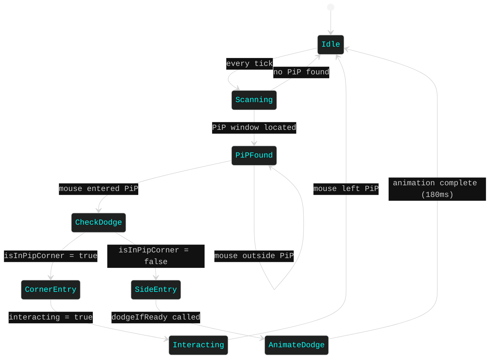
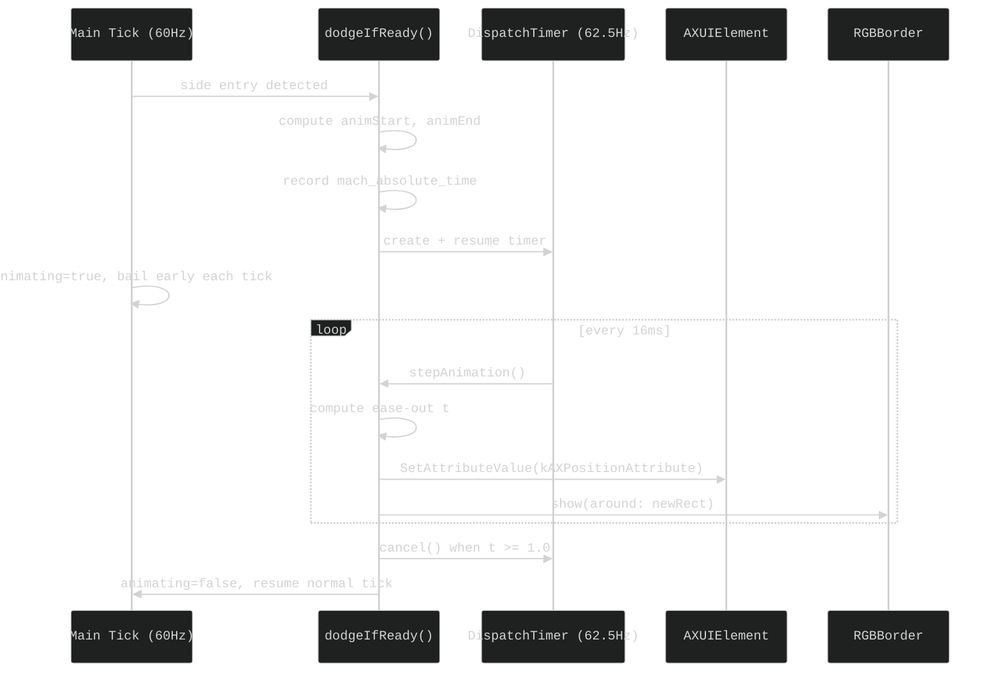
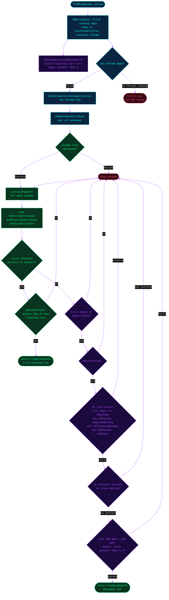
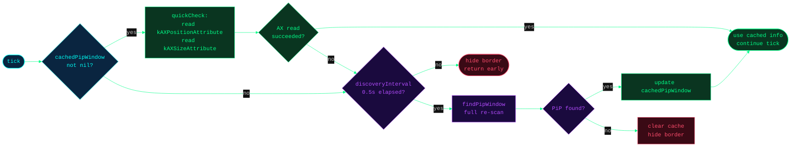

# Dodge System

The xpip dodge system is the behavioral core of the daemon. It watches for a Picture-in-Picture (PiP) window, classifies every mouse entry into that window as either an intentional interaction or an accidental hover, and — when the entry looks accidental — smoothly relocates the PiP to the screen corner furthest from the cursor.

This document covers the full lifecycle: how PiP windows are detected and verified, how entry intent is classified, how the animation plays out, and how the target corner is chosen.

---

## Table of Contents

1. [Dodge Behavior](#1-dodge-behavior)
2. [Corner Detection Algorithm](#2-corner-detection-algorithm)
3. [Dodge Animation](#3-dodge-animation)
4. [Target Corner Selection](#4-target-corner-selection)
5. [PiP Window Detection](#5-pip-window-detection)
6. [Caching Strategy](#6-caching-strategy)

---

## 1. Dodge Behavior

The fundamental insight behind the dodge system is that deliberate interaction with a PiP window almost always begins at a corner — the user reaches for the playback controls that browsers render there. Accidental hover, by contrast, tends to arrive from an edge or the middle of the window. xpip exploits this asymmetry: corner entry is allowed through unchanged; non-corner entry triggers an immediate relocation.

The diagram below shows the complete state machine that runs every tick (~16 ms). Each arc is labeled with the condition that drives the transition.



**Idle** is the resting state between ticks. **Scanning** represents the lightweight AX lookup that runs every tick to locate the PiP window (backed by caching — see [Section 6](#6-caching-strategy)). Once a PiP is found, the daemon sits in **PiPFound** tracking border position until the mouse crosses into the window. At that point `isInPipCorner` decides between **CornerEntry** (user wants to interact) and **SideEntry** (accidental hover, dodge fires). **AnimateDodge** runs for 180 ms via a high-frequency timer, then the system returns to **Idle** ready for the next event.

---

## 2. Corner Detection Algorithm

The corner detection algorithm defines a zone in each corner of the PiP window. If the cursor lands inside one of those zones on entry, the system classifies the hover as intentional and leaves the window alone.

### Zone Layout

```
PiP window bounds
┌─────────────────────────────────────────┐
│ [TL zone]              [TR zone]        │
│ ┌──────┐                    ┌──────┐    │
│ │  cs  │                    │  cs  │    │
│ └──────┘                    └──────┘    │
│                                         │
│           (side / center area)          │
│                                         │
│ ┌──────┐                    ┌──────┐    │
│ │  cs  │                    │  cs  │    │
│ └──────┘                    └──────┘    │
│ [BL zone]              [BR zone]        │
└─────────────────────────────────────────┘

cs = cornerSize (clamped to min(settings.cornerSize, min(width, height) / 2))
```

A mouse position is classified as a corner entry when it is simultaneously near a horizontal edge **and** near a vertical edge. The implementation in `DodgeDaemon.swift:191` is:

```swift
let cs = min(settings.cornerSize, min(pipBounds.width, pipBounds.height) / 2)
let nearLeft   = mousePos.x - pipBounds.minX < cs
let nearRight  = pipBounds.maxX - mousePos.x < cs
let nearTop    = mousePos.y - pipBounds.minY < cs
let nearBottom = pipBounds.maxY - mousePos.y < cs
return (nearLeft || nearRight) && (nearTop || nearBottom)
```

The `cornerSize` clamp guarantees the algorithm degrades gracefully on very small windows: on a 200 × 100 PiP with a cornerSize of 80, the effective `cs` becomes 50 (half of the shorter dimension), preventing the four zones from overlapping in the center.

| Condition | Result |
|-----------|--------|
| `(nearLeft \|\| nearRight) && (nearTop \|\| nearBottom)` | Corner — allow interaction |
| Any other position | Side/center — trigger dodge |

---

## 3. Dodge Animation

When a side-entry dodge is triggered, the PiP window is relocated via a smooth 180 ms animation. The animation runs on a dedicated `DispatchSourceTimer` separate from the 60 Hz main tick, so heavy AX calls during the animation do not block other daemon work.

### Timer and Timing

```swift
// DodgeDaemon.swift:168
let t = DispatchSource.makeTimerSource(flags: .strict, queue: .main)
t.schedule(deadline: .now(), repeating: .milliseconds(16), leeway: .milliseconds(2))
t.setEventHandler { [weak self] in self?.stepAnimation() }
```

The timer fires every 16 ms (~62.5 Hz), giving fluid motion on 60 Hz and ProMotion displays. `.strict` minimizes coalescing jitter. `mach_absolute_time` provides nanosecond-precision elapsed time, converted using the cached `mach_timebase_info`:

```swift
let elapsed = mach_absolute_time() - animStartMach
let sec = Double(elapsed * UInt64(info.numer) / UInt64(info.denom)) / 1_000_000_000
let t = min(sec / animDuration, 1.0)   // animDuration = 0.18 seconds
```

### Easing Function

The position uses a **cubic ease-out** curve, which starts fast and decelerates into the target — giving the impression of the window snapping away briskly then settling gently:

```
ease = 1.0 - (1.0 - t)³
```

```
1.0 ┤                    ╭───
    │                ╭───
    │             ╭──
    │           ╭─
    │          ╱
    │        ╱
    │      ╱
0.0 ┤────╱
    └──────────────────────▶ t (0 → 1 over 180ms)
```

At `t = 0.5` (halfway through time), `ease ≈ 0.875` — the window has already covered 87.5% of its distance. This front-loaded motion minimizes obstruction time.

### Position Update and Border Sync

Every timer tick, the interpolated position is written to the AX attribute and the border overlay is repositioned in the same call:

```swift
// DodgeDaemon.swift:130
AXUIElementSetAttributeValue(win, kAXPositionAttribute as CFString, val)
// Immediately after — microseconds apart
rgbBorder.show(around: CGRect(origin: pos, size: animSize))
```

Synchronizing the border in the same handler call prevents the visual "lag" of the glow ring trailing behind the moving window.

### Animation Lifecycle



The `animating` flag causes the main 60 Hz tick to return early for the duration, avoiding concurrent AX calls from both the tick and the animation timer.

---

## 4. Target Corner Selection

When a dodge fires, the target is the screen corner whose center is geometrically furthest from the current mouse position. This ensures the window always moves in the direction that maximizes distance from the cursor — the most natural direction for "get out of the way."

### Algorithm

`getFurthestCorner()` in `ScreenGeometry.swift:14` enumerates all four screen corners, each inset by `settings.margin` and adjusted for window size so the final position respects screen edges:

```swift
let corners: [CGPoint] = [
    CGPoint(x: screen.minX + m,                    y: screen.minY + m),                     // top-left
    CGPoint(x: screen.maxX - windowSize.width - m, y: screen.minY + m),                     // top-right
    CGPoint(x: screen.minX + m,                    y: screen.maxY - windowSize.height - m), // bottom-left
    CGPoint(x: screen.maxX - windowSize.width - m, y: screen.maxY - windowSize.height - m), // bottom-right
]
```

Distance is measured from the mouse to the **center** of the window in each candidate corner (squared distance — no `sqrt` needed for comparison):

```swift
let cx = corner.x + windowSize.width / 2
let cy = corner.y + windowSize.height / 2
let dist = (mousePos.x - cx)² + (mousePos.y - cy)²
```

### Skip Condition

If the PiP window is already within 30 px of the target corner, the dodge is skipped entirely — no animation, no re-trigger of the cooldown:

```swift
let alreadyThere = abs(pip.bounds.origin.x - target.x) < 30
                && abs(pip.bounds.origin.y - target.y) < 30
guard !alreadyThere else { return }
```

### Visual Example

```
Screen (1440 × 900, margin = 20)
┌──────────────────────────────────────────────┐
│ [TL]                                  [TR]   │
│  *                                           │  * = candidate corner origins
│                                              │
│                  + ← mouse                   │
│                                              │
│ [BL]                                  [BR]   │
│                                           *  │  furthest from mouse → BR chosen
└──────────────────────────────────────────────┘
```

The corner whose **center** (star shifted by half window size) is most distant from `+` wins.

---

## 5. PiP Window Detection

Finding the PiP window is the most complex part of the system. Chrome exposes PiP windows through its Accessibility API, but Chrome also creates dozens of other floating UI elements — extension popups, devtools panels, omnibox dropdowns — that must be distinguished from an actual PiP window without false positives.

The diagram below shows the full `findPipWindow()` flow implemented in `PipDiscovery.swift`.



### Detection Paths

There are two independent paths to a positive identification:

#### Path A — Title Match

```
title.lowercased().contains("picture in picture")
  || title.lowercased().contains("picture-in-picture")
AND matchesFloat (window position/size within ±3px of a CGWindowList floating rect)
```

The floating cross-check is critical: Chrome's main tab title sometimes contains "Picture in picture" while a video is actively in PiP mode. Without `matchesFloat`, the main YouTube tab would be incorrectly identified as the PiP window.

#### Path B — Document PiP Heuristics

Document PiP (Chrome's newer API, available in Chrome 116+) creates windows with no title or `about:blank`. Because the title cannot be used for identification, the system applies a five-layer filter:

| Check | Criterion | Rationale |
|-------|-----------|-----------|
| Title | `""` or `"about:blank"` | Document PiP windows have no meaningful title |
| Float | within ±3px of CGWindowList floating rect | Confirms window is above normal layer |
| AX role | `role == "" || role == "AXWindow"` | Rules out non-window AX elements |
| AX subrole | not `AXDialog`, `AXSystemDialog`, `AXFloatingWindow` | Rules out Chrome dialogs and panel floats |
| Buttons | no minimize, no close button | Real PiP windows have neither button |
| Size | 200–800 × 100–600 px, aspect ratio > 1.4 | PiP is always landscape; Chrome popups are often portrait or square |

All five layers must pass simultaneously. A window that clears four of five is still rejected.

### Floating Window Cross-Reference

`floatingWindowRects()` calls `CGWindowListCopyWindowInfo` with `.optionOnScreenOnly` and filters for `kCGWindowLayer > 0`. This gives a list of rects for every window above the standard desktop layer at the moment of the scan.

`matchesFloat` then checks each AX window's position against this list with a ±3 px tolerance to account for sub-pixel rounding between the two APIs:

```swift
let matchesFloat = floating.contains { r in
    abs(r.origin.x - pos.x) < 3 && abs(r.origin.y - pos.y) < 3
        && abs(r.width - size.width) < 3 && abs(r.height - size.height) < 3
}
```

This cross-reference is the primary mechanism that prevents non-PiP Chrome UI from matching.

---

## 6. Caching Strategy

The Accessibility API is expensive. Each `AXUIElementCopyAttributeValue` call involves an IPC round-trip to the Chrome process. Running a full `findPipWindow()` scan every tick at 60 Hz would impose constant IPC overhead even when the PiP window is static.

The caching layer reduces this cost to a single fast AX read per tick in the common case.



### Two-Tier Access Pattern

**Fast path (every tick):** `quickCheck()` reads only `kAXPositionAttribute` and `kAXSizeAttribute` from the cached `AXUIElement`. If both reads succeed, the PiP window position is known in ~2 IPC calls and the tick proceeds normally.

**Slow path (every 0.5 s, or after cache miss):** `findPipWindow()` runs the full detection scan — querying all Chrome windows, reading titles, cross-referencing floating rects, checking AX roles and button attributes. This is throttled to at most twice per second by `discoveryInterval = 0.5`.

### Cache Invalidation

The cache is cleared (`cachedPipWindow = nil`) whenever:

- `quickCheck()` fails (the AX element is stale — window was closed or Chrome restarted)
- `findPipWindow()` returns `nil` during a slow-path scan

When the cache is cleared and the throttle prevents an immediate re-scan, the daemon hides the border overlay and returns early. The next slow-path opportunity (up to 0.5 s later) will attempt to rediscover the window.

### Performance Summary

| Condition | AX calls per tick | Frequency |
|-----------|-------------------|-----------|
| PiP window stable, cached | 2 | Every tick (~60 Hz) |
| Cache miss, throttled | 0 (early return) | Up to 2× per second |
| Cache miss, re-scan | Full scan (~10–30 calls) | At most 2× per second |
| No PiP window | 0 (after fast fail) | Every tick |
