# Game Engine

xpip's game engine is a lightweight, protocol-driven system that turns any active Picture-in-Picture window into the primary game object. There is no separate render target for the game world — the PiP window itself is the ball, the ship, the frog, or the player character, moved each tick via macOS Accessibility APIs. All decorative overlays (pipes, paddles, score HUDs, particle bursts) are transparent `NSWindow` layers rendered at `.floating` level above all other app content.

---

## 1. Architecture

### 1.1 Protocol and Abstract Base

The engine is built from two layers: the `MiniGame` protocol defines a minimal contract for any game, and `GameBase` provides the concrete implementation of everything that every game needs.

The diagram below shows the full class hierarchy with key properties and methods. All twelve playable game modes inherit from `GameBase`, which itself conforms to `MiniGame`.

```mermaid
%%{init: {'theme': 'dark', 'themeVariables': {'primaryColor': '#0a2540', 'primaryTextColor': '#00fff5', 'primaryBorderColor': '#00fff5', 'lineColor': '#b44dff', 'secondaryColor': '#1a0a3e', 'tertiaryColor': '#0a3520', 'edgeLabelBackground': '#111', 'clusterBkg': '#0d0d1a'}}}%%
classDiagram
    direction TB

    class MiniGame {
        <<protocol>>
        +active: Bool
        +lastBounds: CGRect
        +start(screen, pip, border)
        +stop()
    }

    class GameState {
        <<enum>>
        ready
        playing
        gameOver
    }

    class LayerPool {
        +dequeue() CALayer
        +enqueue(layer)
        +drain()
    }

    class SoundKit {
        +shared: SoundKit$
        +preload()
        +play(sfx: SFX)
    }

    class GameBase {
        <<abstract>>
        +active: Bool
        +lastBounds: CGRect
        +cachedAXWindow: AXUIElement?
        +cachedPipSize: CGSize
        +borderRef: RGBBorder?
        +screenH: CGFloat
        +lastMach: UInt64
        +score: Int
        +state: GameState
        +layerPool: LayerPool
        +gameEndMach: UInt64
        +gameOverDelay: 2.5s
        -timerIntervalMs: Int = 2
        -gameTimer: DispatchSourceTimer?
        +machToSeconds(ticks) CGFloat
        +deltaTime() CGFloat
        +verifyPipAlive() Bool
        +refreshPipSize()
        +movePip(to) Bool
        +syncBorder(around)
        +triggerGameOver(message)
        +checkGameOverTimeout() Bool
        +createScoreOverlay(screen, width)
        +createFullscreenOverlay(screen)
        +mousePosition() CGPoint?
        +isMouseDown: Bool
        +renderPixelArt(pixels, scale) CGImage?$
        +pixelArtLayer(pixels, scale, size) CALayer$
        +rectsCollide(a, b) Bool$
        +circleHitsRect(center, radius, rect) Bool$
        +distance(a, b) CGFloat$
        +pointInRect(point, rect) Bool$
        +onStart(screen, pip)*
        +onStop()*
        +gameTick()*
    }

    class PiPongGame {
        timerIntervalMs = 8
        -baseSpeed: 420 px/s
        -maxSpeed: 900 px/s
        -aiReactionDelay: 0.15s
        -winScore: 7 by 2
        -trailCount: 3
    }
    class PiPong2Game {
        timerIntervalMs = 8
        -ballSize: 16
        -baseSpeed: 420 px/s
        -maxSpeed: 900 px/s
        -aiReactionDelay: 0.15s
        -winScore: 7 by 2
    }
    class FlappyGame {
        timerIntervalMs = 4
        -gravity: 900
        -flapImpulse: -360
        -pipeBodyWidth: 56
        -pipeCapWidth: 70
    }
    class SnakeGame {
        timerIntervalMs = 8
        -maxTurnRate: 6 rad/s
        -sampleDistance: 6px
        -cameraLerp: 0.08
        -worldScale: 3x screen
    }
    class BounceGame {
        timerIntervalMs = 2
        +paddleMode: Bool
        -gravity: 120
        -elasticity: 0.9
        -airFriction: 0.9993
        -restThreshold: 3 px/s
    }
    class BreakoutGame {
        timerIntervalMs = 8
        -brickCols: 10
        -brickRows: 5
        -lives: 3
        -rowScores: [50,40,30,20,10]
    }
    class InvadersGame {
        timerIntervalMs = 8
        -cols: 8
        -rows: 5
        -maxPlayerBullets: 3
        -alienShotInterval: 1.5s
    }
    class FroggerGame {
        timerIntervalMs = 8
        -laneCount: 8
        -hopDuration: 0.15s
    }
    class RunnerGame {
        timerIntervalMs = 8
        -zone system
        -sinusoidal gaps
    }
    class AsteroidsGame {
        timerIntervalMs = 2
        -maxBullets: 5
        -bulletLifetime: 2.0s
        -cameraLerp: 0.08
        -worldScale: 3x screen
    }
    class CursorHuntGame {
        timerIntervalMs = 2
        -baseAccel: 400
        -maxSpeedCap: 1600
        -friction: 0.985
    }
    class DoodleJumpGame {
        timerIntervalMs = 2
        -gravity: 900
        -bounceImpulse: -520
        -strongBounce: -620
    }
    class PacManGame {
        timerIntervalMs = 8
        -gridCols: 21
        -gridRows: 21
        -playerSpeed: 3.2 cells/s
    }

    MiniGame <|.. GameBase : implements
    GameBase --> GameState
    GameBase --> LayerPool
    GameBase <|-- PiPongGame
    GameBase <|-- PiPong2Game
    GameBase <|-- FlappyGame
    GameBase <|-- SnakeGame
    GameBase <|-- BounceGame
    GameBase <|-- BreakoutGame
    GameBase <|-- InvadersGame
    GameBase <|-- FroggerGame
    GameBase <|-- RunnerGame
    GameBase <|-- AsteroidsGame
    GameBase <|-- CursorHuntGame
    GameBase <|-- DoodleJumpGame
    GameBase <|-- PacManGame
```



### 1.2 Singleton Instances

Each game class is instantiated exactly once at module load time as a file-scope `let` constant. This makes each instance globally accessible without reference passing:

```swift
let pipong     = PiPongGame()    // PiPong classic: PiP = ball
let pipong2    = PiPong2Game()   // PiPong 2: PiP = paddle
let flappy     = FlappyGame()
let snake      = SnakeGame()
let bounce     = BounceGame()    // serves both physics toy and paddle modes
let breakout   = BreakoutGame()
let invaders   = InvadersGame()
let frogger    = FroggerGame()
let runner     = RunnerGame()
let asteroids  = AsteroidsGame()
let cursorhunt = CursorHuntGame()
let doodlejump = DoodleJumpGame()
let pacman     = PacManGame()
```

`BounceGame` serves double duty: the same instance is reused in both pure physics mode (`paddleMode = false`) and paddle challenge mode (`paddleMode = true`), toggled before `start()` is called.

---

## 2. Game Lifecycle

This sequence diagram traces the full lifecycle of a game session from user trigger to automatic stop. The critical moment is `toggleGame()` in `DodgeDaemon`, which gates on an active PiP window before handing control to the selected game.


### Key invariants

- Only one game can be active at a time. `toggleGame()` stops all running games before starting a new one.
- The daemon's main-loop timer (`tick()`) returns immediately when any game is active, avoiding AX IPC contention.
- `movePip(to:)` calls `stop()` on AX error, cleanly aborting the game if the PiP window disappears.
- `verifyPipAlive()` provides an additional safety check — games call it at the top of `gameTick()` to detect and handle PiP window disappearance.
- `deltaTime()` is clamped to 50 ms (20 fps equivalent), preventing physics tunneling if the main thread stalls.
- `layerPool.drain()` is called in `stop()` to release all recycled layers, preventing memory accumulation across sessions.
- The `GameState` enum (`ready`, `playing`, `gameOver`) provides a clean three-phase lifecycle with `triggerGameOver()` and `checkGameOverTimeout()` managing transitions.

---

## 3. Rendering System

All visual elements in every game are macOS windows — there is no off-screen rendering or custom compositing. The engine uses two overlay patterns, both sharing the same window configuration.

### 3.1 Fullscreen Overlay

The `createFullscreenOverlay(screen:)` method produces a transparent, non-interactive window that spans the full screen. Game elements (pipes, asteroids, bricks, etc.) are `CALayer` subtrees attached to the root layer of this window's content view.

```
NSWindow (fullscreen)
  styleMask: .borderless
  backgroundColor: .clear
  isOpaque: false
  level: .floating
  ignoresMouseEvents: true
  hasShadow: false
  collectionBehavior: [canJoinAllSpaces, stationary, transient, ignoresCycle]
    └── contentView (wantsLayer: true)
          └── rootLayer (CALayer)
                ├── spriteLayer_0 (CALayer)
                ├── spriteLayer_1 (CALayer)
                └── emitterLayer (CAEmitterLayer)   ← particles
```

All layer mutations inside `gameTick()` are wrapped in `CATransaction.begin()` / `CATransaction.commit()` with `setDisableActions(true)` to suppress Core Animation's default implicit transitions. This keeps visual updates frame-synchronous with the physics tick.

### 3.2 Score Overlay

Each game creates a separate `160 × 44` pt `NSWindow` (width varies by game) positioned near the top of the screen for the score HUD. It uses `NSVisualEffectView` with `.hudWindow` material for the frosted-glass appearance:

```
NSWindow (160 × 44, centered top)
  styleMask: .borderless
  backgroundColor: .clear
  level: .floating
  ignoresMouseEvents: true
    └── NSVisualEffectView (.hudWindow, .behindWindow, .active)
          wantsLayer: true
          layer.cornerRadius: 8
            └── NSTextField (24pt monospaced bold, white, centered)
```

The score label is mutated directly each tick. Pong uses a wider overlay and shows `"player : ai"` format; Flappy and CursorHunt track best score and survival time respectively.

### 3.3 Pixel Art Renderer

`GameBase` provides a static software renderer that converts a 2D array of `UInt32` ARGB hex values into a `CGImage`. Transparent pixels are represented by `0`. The `scale` parameter performs nearest-neighbor integer upscaling at bake time — the resulting image is set on a `CALayer` with `.nearest` magnification and minification filters to preserve crisp pixel boundaries at any display scale.

```swift
// Usage pattern across game files:
let img = GameBase.renderPixelArt(pixels, scale: 3)
layer.contents = img
layer.magnificationFilter = .nearest
layer.minificationFilter = .nearest
```

Sprite images (pipe caps, ghost faces, vehicle sprites, platform tiles) are baked at module load time as static constants in dedicated sprite enum files under `Sprites/`, so there is zero per-frame allocation for pixel art rendering.

### 3.4 Layer Pooling

Each `GameBase` instance owns a `LayerPool` (defined in `LayerPool.swift`). Games that frequently create and destroy `CALayer` objects — Snake (tail segments), Invaders (alien grid + bullets), Breakout (brick destruction), Asteroids (debris + bullets) — use pooling to eliminate allocation overhead in hot-path ticks.


The `enqueue()` method performs a full property reset: `removeAllAnimations()`, `contents = nil`, `sublayers = nil`, `isHidden = true`, `opacity = 1.0`, `transform = CATransform3DIdentity`, `backgroundColor = nil`, `borderWidth = 0`, `cornerRadius = 0`, and `removeFromSuperlayer()`.

### 3.5 Sound Effects

`SoundKit` (defined in `SoundKit.swift`) provides a centralized audio layer. Five `SFX` enum cases map to macOS system sounds:

| SFX | NSSound Name | Typical Usage |
|-----|-------------|---------------|
| `.hit` | Tink | Paddle contact, brick hit, bullet impact |
| `.score` | Pop | Point scored, food collected |
| `.death` | Basso | Player death, game over |
| `.shoot` | Funk | Bullet fired |
| `.bounce` | Purr | Wall bounce, platform landing |

`SoundKit.shared.preload()` is called once in `main.swift` at daemon startup. Games call `SoundKit.shared.play(.sfx)` inline during `gameTick()`. If a sound is already playing, it is stopped and restarted immediately to avoid queuing.

### 3.6 Collision Helpers

Four static methods on `GameBase` standardize collision detection across all game modes, replacing per-game inline implementations:

| Method | Algorithm | Games Using It |
|--------|-----------|----------------|
| `rectsCollide(_:_:)` | `CGRect.intersects` — AABB overlap | Breakout, Frogger, Runner, Snake, Invaders |
| `circleHitsRect(center:radius:rect:)` | Nearest-point clamping: clamp circle center to rect, check distance ≤ radius | Asteroids, Pong ball collision |
| `distance(_:_:)` | `√(dx² + dy²)` — Euclidean distance | CursorHunt, Asteroids bullet-asteroid check |
| `pointInRect(_:_:)` | `CGRect.contains` — point containment | Pac-Man dot collection, Bounce grab detection |

### 3.7 Sprite Extraction

Pixel-art sprite data has been extracted from inline arrays in game files into 10 dedicated `enum` types under `daemon/Games/Sprites/`. Each enum holds `static let` properties of type `CGImage?`, baked at module load time via `GameBase.renderPixelArt()`.


This separation keeps game logic files focused on mechanics (typically 200-500 lines each) while sprite data (often 100-400 lines of hex color arrays) lives in dedicated files.

---

## 4. Timer Architecture

Each game sets `timerIntervalMs` before calling `super.start()`. The base class schedules a `DispatchSource.makeTimerSource(flags: .strict, queue: .main)` with `.microseconds(100)` leeway. Using `.strict` prevents the OS from coalescing the timer with other main-queue work.

| Interval | Games |
|---|---|
| 2 ms (~500 Hz) | Bounce, BounceGame (paddle), Snake, Asteroids, CursorHunt, DoodleJump |
| 4 ms (~250 Hz) | Flappy |
| 8 ms (~125 Hz) | PiPong, PiPong 2, Snake, Breakout, Invaders, Frogger, Runner, PacMan |

The 2 ms games require sub-frame precision for fluid physics (gravity, drift, collision) or tightly-coupled input (cursor tracking). The 8 ms games are turn-based or have coarser physics where the higher overhead of AX calls dominates.

All games read `deltaTime()` at the top of `gameTick()`. This method computes elapsed time using `mach_absolute_time()` — the highest-resolution monotonic clock available on macOS — converted to seconds via the static `mach_timebase_info`. The result is clamped to `0.05` seconds to bound physics integration error during stalls.

---

## 5. Game Spec Cards

The following sections provide complete technical specifications for each of the thirteen game modes.

---

### 5.1 PiPong (Classic)

**Singleton:** `pipong` | **Timer:** 8 ms

The PiP window is the ball. Two paddles rendered as floating `NSWindow` rectangles bracket the screen. The player controls the left paddle by moving the mouse vertically; the AI controls the right paddle. First to 7 goals, win by 2, constitutes a match.

**Sprites:** Uses `FlappySprites` for glow cycle colors (purple → cyan → green).

**Physics and Ball Dynamics**

Ball speed ramps linearly from 420 px/s to 900 px/s over the first 15 seconds of each rally (`speedRampDuration = 15.0`). Speed is re-normalized every tick so direction changes from paddle hits do not permanently alter the magnitude. A new rally timer starts after each goal.

Paddle hit deflection adds an angular component proportional to the hit position relative to paddle center (`hit = (ballCY - paddleY) / paddleHeight - 0.5`), multiplied by 200 px/s, giving skilled players control over angle.

**AI Behavior**

The AI uses a 150 ms reaction delay (`aiReactionDelay = 0.15`). It samples the ball's center Y position only when the ball has crossed screen midpoint and is heading toward the AI side, then adds a noise offset drawn from `CGFloat.random(in: -noiseMag...noiseMag)`. Noise magnitude is adaptive: when the player leads by 3+ goals, noise shrinks to 5 px (harder AI); when the AI leads by 3+, it grows to 40 px (easier AI). When the ball moves away, the AI drifts back to screen center.

**Ball Trail**

Three ghost layers (`trailCount = 3`) are maintained as `CALayer` circles attached to a dedicated trail `NSWindow`. Positions are sampled every 2 frames and stored in a ring buffer. Each ghost is rendered at decreasing opacity (approximately 0.75, 0.5, 0.25) and shrinking radius (15% scale reduction per step).

**Screen Shake**

On each goal, `triggerShake()` sets a 5-frame shake counter. Each frame applies a random `±3 px` offset to all visual elements (paddles, score overlay, trail window) before committing the `CATransaction`.

**Paddle Flash**

On ball-paddle contact, `flashPaddle()` fires a `CABasicAnimation` on the paddle layer's `backgroundColor` from the current glow color to white over 0.1 seconds.

| Property | Value |
|---|---|
| Base speed | 420 px/s |
| Max speed | 900 px/s |
| Ramp duration | 15 s per rally |
| AI reaction delay | 150 ms |
| Win condition | 7 goals, win by 2 |
| Trail ghosts | 3 layers |
| Shake duration | 5 frames |


---

### 5.1b PiPong 2

**Singleton:** `pipong2` | **Timer:** 8 ms

A variant where the PiP window is the player's paddle (controlled by mouse Y), and the ball is a separate 16px overlay window. The AI controls the opposite paddle. Same match format (first to 7, win by 2), same speed ramp and AI behavior as PiPong classic, but the perspective is reversed — the player is now the paddle rather than the ball.

| Property | Value |
|---|---|
| Ball size | 16 × 16 pt overlay |
| Paddle height | 150 pt |
| AI speed | 300 px/s |
| Base ball speed | 420 px/s |
| Max ball speed | 900 px/s |
| Win condition | 7 goals, win by 2 |


---

### 5.2 Flappy Bird

**Singleton:** `flappy` | **Timer:** 4 ms

The PiP window is resized to `200 × 112` pt at game start via `kAXSizeAttribute`. This makes it small enough to fit through pipe gaps. A single click starts the game; subsequent clicks trigger flap impulses. The border tilts dynamically to reflect the velocity angle, providing physicality without being able to rotate Chrome's window.

**Physics**

Gravity accumulates downward at 900 px/s². Each left-click fires an upward impulse of −360 px/s, overwriting the current velocity. Fall speed is capped at 700 px/s. Before the first click, the bird bobs using `sin(time)` oscillation.

**Pipe Generation**

Pipes are pairs of `NSWindow` objects, one top-anchored and one bottom-anchored. Each pipe window contains two `CALayer` children — a body layer with tiling pixel-art brick pattern (18 × 8 sprite at scale 3) and a cap layer with the wider flared end cap (22 × 8 sprite at scale 3). Pipes scroll left at 200 px/s. A new pair spawns when the rightmost pipe crosses `screen.maxX - pipeInterval` (pipe width + 250 pt). Gap center is randomized within safe vertical bounds.

The gap height is `cachedPipSize.height + 160`, so larger PiP windows see proportionally larger gaps.

**Border Tilt**

`tiltAngle` is a lerped version of `velocity / 800.0`, clamped to `[-0.3, 0.6]` radians. The lerp coefficient is 0.06 per tick, producing smooth tilt lag that reads as inertia.

**Best Score**

Flappy maintains a `bestScore` variable across sessions (within the same daemon lifetime). Game-over message includes the current score: `"Game Over  N"`.

| Property | Value |
|---|---|
| PiP resize | 200 × 112 pt |
| Gravity | 900 px/s² |
| Flap impulse | −360 px/s |
| Max fall speed | 700 px/s |
| Pipe body width | 56 pt |
| Pipe cap width | 70 × 28 pt |
| Scroll speed | 200 px/s |
| Gap height | pipHeight + 160 pt |


---

### 5.3 Snake

**Singleton:** `snake` | **Timer:** 8 ms

The PiP window is the snake's head, steered toward the mouse cursor in world space. The snake inhabits a 3× screen-sized toroidal world with camera-follow smoothing. Pixel-art sprites (head, body, tail segments, apple food item) are rendered as floating `NSWindow` instances — one per tail segment — positioned each tick.

**Steering Model**

Each tick the engine computes the angle from head center to the mouse cursor's world position. If the angular difference exceeds `maxTurnRate × dt` (6 rad/s), it is clamped, producing a smooth curve limit. This prevents instant 180-degree turns.

**Tail Tracking**

The snake samples `headPos` into a `distanceSamples` array every time the accumulated travel distance exceeds `sampleDistance = 6.0` px. Tail segment `i` reads its position from `distanceSamples[count - 1 - (i+1) × segmentSpacingSamples]` where `segmentSpacingSamples = 5`. This creates a consistent physical spacing regardless of speed or frame rate.

**Click Boost**

A left-click triggers 2× speed for 0.3 s (`boostDuration`). A 2-second cooldown (`boostCooldown`) prevents spamming. During boost, `effectiveSpeed` is capped at `maxSpeed × boostMultiplier`.

**Self-Collision**

Head vs. tail uses inset rectangles to allow the snake to almost-overlap without false positives. Head rect is inset by 4 px; tail segment rects are scaled by `segScaleForIndex(i)` (0.9 at head, 0.6 at tip) and additionally inset by 4 px.

**Camera**

Camera position lerps toward the head center at rate 0.08 per tick. World wrapping is handled by modular arithmetic on both axes when the head crosses world boundaries.

**Food Particles**

On food collection, a `CAEmitterLayer` burst fires from the apple's world position using two `CAEmitterCell` types (red and green dots, 5 births each, 0.4 s lifetime, additive blend mode). The emitter is removed after 0.5 s.

| Property | Value |
|---|---|
| World size | 3× screen |
| Max turn rate | 6 rad/s |
| Sample distance | 6 px |
| Segment spacing | 5 samples |
| Base speed | 200 px/s |
| Speed per food | +10 px/s (max 340) |
| Boost | 2× for 0.3 s, 2 s cooldown |
| Camera lerp | 0.08 |


---

### 5.4 Bounce (Physics Toy)

**Singleton:** `bounce` (paddleMode = false) | **Timer:** 2 ms

The PiP window is a physics object: gravity pulls it down, screen edges reflect it with elasticity, and the user can grab and throw it. The border ring tilts to reflect the current velocity angle.

**Physics**

Gravity accumulates at 120 px/s² (gentle, suitable for a toy). Air friction multiplies velocity by 0.9993 per tick. On edge contact, the normal component of velocity is reflected and attenuated by elasticity 0.9. The PiP cannot travel faster than 2000 px/s in any axis.

**Grab and Throw**

When the user presses the left mouse button while the cursor intersects the PiP rect, dragging begins. A position history ring buffer of up to 8 samples is maintained. On mouse-up, throw velocity is computed as `(lastPos - firstPos) / elapsedTime` over the recent history, giving a natural flick throw.

**Rest Detection**

When the magnitude of velocity drops below `restThreshold = 3.0` px/s and the PiP is resting on the floor edge, the PiP settles without jitter (no perpetual micro-bouncing).

**Border Tilt**

`tiltAngle` is updated toward `atan2(velocity.y, velocity.x) / π` each tick. The border ring rotates to match, giving the impression of spin.

| Property | Value |
|---|---|
| Gravity | 120 px/s² |
| Elasticity | 0.9 |
| Air friction | 0.9993 per tick |
| Rest threshold | 3 px/s |
| Throw history | 8 samples |


---

### 5.5 Bounce Paddle (Challenge Mode)

**Singleton:** `bounce` (paddleMode = true) | **Timer:** 2 ms

Same physics as the Bounce toy, but an AI paddle tracks the ball on whichever screen edge is farthest from the current ball position. The score increments each time the ball contacts the paddle. Sacred geometry burst overlays fire at score milestones.

**AI Paddle**

The paddle is an `80 × 6` pt `NSWindow` with a pixel-art gradient shimmer sprite (28 × 3 pixels at scale 3, colors match the active glow color setting). The paddle tracks a normalized position `paddleEdgeT ∈ [0, 1]` along its assigned edge, lerping toward the ball's projected intercept at speed 0.4 per tick.

**Milestone Bursts**

Sacred geometry burst overlays (provided by `RGBBorder`) fire at scores 20, 50, and 100. The tier escalates: tier 1 at 20, tier 2 at 50, tier 3 at 100. Each milestone is tracked in a `Set<Int>` to prevent repeat triggers.

**Score Display**

A `100 × 32` pt vibrancy HUD overlay with 18 pt monospaced bold text shows the current rally count.

| Property | Value |
|---|---|
| Paddle size | 80 × 6 pt |
| Paddle speed | 0.4 lerp per tick |
| Milestone bursts | 20 (tier 1), 50 (tier 2), 100 (tier 3) |


---

### 5.6 Breakout

**Singleton:** `breakout` | **Timer:** 8 ms

Classic brick-breaking game. The PiP window is the ball. Mouse X controls the paddle. Ten columns × five rows of bricks fill the top portion of the screen. The top two rows require two hits to destroy.

**Brick Grid**

Bricks are `60 × 21` pt `CALayer` instances with `4 pt` horizontal and vertical spacing, rendered on a fullscreen overlay window. Row colors run from dark crimson (top, 50 pts) through purple, dark navy, dark teal, to dark green (bottom, 10 pts). Two-hit bricks in the top two rows visually shift to a lighter shade on the first hit.

**Ball Physics**

Ball launches from above the paddle on the first click. Speed ramps per level: base 350 px/s, max 700 px/s. Paddle hit deflection adds an angle contribution from hit position. Brick destruction fires a `CAEmitterLayer` burst at the impact point with per-row particle colors.

**Lives and Levels**

The game starts with 3 lives. Extra lives are awarded at 500 and 1500 points (once each). Each level that follows a completed screen shrinks the paddle by 20 px (minimum 80 px) and increases ball speed by 10 px/s. The paddle flashes white and spring-bounces on ball contact using `CABasicAnimation`.

**Scoring**

| Row (top to bottom) | Points |
|---|---|
| Row 1 | 50 |
| Row 2 | 40 |
| Row 3 | 30 |
| Row 4 | 20 |
| Row 5 | 10 |


---

### 5.7 Space Invaders

**Singleton:** `invaders` | **Timer:** 8 ms

An 8 × 5 grid of pixel-art aliens marches across the screen. The PiP window is the player's ship. Mouse X positions the ship; holding the mouse button fires at up to 4 shots per second.

**Alien Sprites**

Each alien is a `CALayer` containing an 11 × 8 pixel-art bitmap (pixel block size 3 pt, final size 33 × 24 pt). Three alien types occupy different rows: squids (rows 1–2), crabs (rows 3–4), and skulls (row 5). The five row color bands map to score values: 10 pts (rows 1–2), 20 pts (rows 3–4), 30 pts (row 5).

**Grid Movement**

The entire alien grid marches as a unit, reversing direction and stepping down one row-height when the leading edge hits a screen boundary. Grid speed increases by a factor of 1.15 per wave. Alien shot interval decreases by a factor of 0.85 per wave. Up to 3 player bullets can be in flight simultaneously.

**Mystery UFO**

A mystery UFO spawns at a random interval between 20 and 30 seconds (`nextUfoDelay`). It traverses the screen horizontally at 150 px/s. Shooting it awards 50, 100, 150, or 300 points randomly. The UFO layer is a pixel-art sprite rendered on the fullscreen overlay.

**Lives and Invulnerability**

The player starts with 3 lives. After being hit, the ship enters a 1.5-second invulnerability window during which it blinks at approximately 10 Hz. Lives are displayed as ship icons in the score overlay.

| Property | Value |
|---|---|
| Grid size | 8 × 5 (40 aliens) |
| Alien sprite | 11 × 8 px at 3× scale |
| Player bullets max | 3 |
| Fire rate (hold) | 4 shots/s |
| Wave speed multiplier | ×1.15 |
| Wave shot interval multiplier | ×0.85 |
| UFO spawn interval | 20–30 s |
| UFO points | 50 / 100 / 150 / 300 |
| Invulnerability | 1.5 s |


---

### 5.8 Frogger

**Singleton:** `frogger` | **Timer:** 8 ms

The PiP window is the frog crossing 8 lanes of traffic. Mouse X sets horizontal position continuously. Left-click hops forward one lane; right-click hops back. A successful crossing advances difficulty.

**Lane Layout**

Lane 0 is the safe starting strip. Lanes 1–6 are traffic lanes with opposing vehicle directions alternating per lane. Lane 7 is the goal strip. Hopping is animated over 0.15 seconds using a linear interpolation on `frogY`.

**Vehicle Types**

Three vehicle types traverse traffic lanes, each rendered as a pixel-art sprite window:

| Type | Width | Speed Multiplier | Sprite |
|---|---|---|---|
| Motorcycle | 20–30 pt | 1.6× | 10 × 8 at scale 2 |
| Car | 40–60 pt | 1.0× | medium pixel-art |
| Truck | 80–100 pt | 0.6× | wide pixel-art |

Base lane speed increases by 15 px/s per successful crossing. Near-miss detection uses an 8 pt expansion of the collision rect; surviving within this zone awards a near-miss bonus.

**Death and Shake**

On collision, the screen shakes at 8 px amplitude for approximately 30 Hz (simulated by alternating pixel offsets each tick) for 0.25 seconds. The frog resets to lane 0 center and lives decrement.


---

### 5.9 Runner

**Singleton:** `runner` | **Timer:** 8 ms

An infinite side-scroller. The PiP window scrolls rightward automatically; the mouse Y position sets the vertical position of the PiP within the screen. Vertical wall obstacles with moving gaps scroll in from the right. Each zone introduces new obstacle tile art and visual themes.

**Obstacle System**

Obstacles are full-height vertical barriers with a gap. Each gap has a `gapBaseY` center and a sinusoidal `gapAmplitude`, producing a moving gap that oscillates over time. Gap height starts at a generous value and narrows as speed increases (200 → 600 px/s over the session).

Each obstacle layer uses tiled pixel-art textures (10 × 4 px at scale 3). Gap edges are highlighted with glow indicator layers so players can track the moving gap.

**Zone System**

Approximately every 10 obstacles, a zone transition announces a new theme and pauses the game briefly. Zone colors cycle through 6 tile themes: grey, blue, purple, brown, forest, crimson.


---

### 5.10 Asteroids

**Singleton:** `asteroids` | **Timer:** 2 ms

The PiP window is the ship in a 3× toroidal world. Mouse aim direction drives thrust; holding the mouse button fires bullets (auto-fire at 4 per second). Asteroids split on destruction.

**Ship Physics**

Thrust accelerates the ship at 400 px/s² in the mouse direction. Velocity decays with a half-life of 0.5 s (`driftHalfLife`), computed as `vx *= pow(0.5, dt / 0.5)` each tick. Maximum speed is 500 px/s.

**Asteroid Sizes and Splitting**

| Size | Radius | Points | On Destruction |
|---|---|---|---|
| Large | 25 pt | 20 | 2 medium |
| Medium | 15 pt | 50 | 2 small |
| Small | 8 pt | 100 | nothing |

Asteroid shapes are rendered as `CAShapeLayer` polygons using randomized vertices around the nominal radius. Rotation is applied per tick using each asteroid's `rotationSpeed`.

**Bullets**

Up to 5 bullets can be in flight simultaneously (`maxBullets`). Each bullet travels at 600 px/s and expires after 2 seconds (`bulletLifetime`). Bullets and asteroids both wrap at world boundaries.

**Explosions**

`CAEmitterLayer` bursts fire at the destruction point with thrust-line and dust particle cells. The ship emits a continuous thrust emitter while holding the fire button.

**Lives and Waves**

3 lives, 2-second invulnerability on respawn with 4 Hz blink. Between waves, a 1.5-second pause displays a "Wave N" message before new asteroids spawn.

| Property | Value |
|---|---|
| World size | 3× screen |
| Thrust | 400 px/s² |
| Drift half-life | 0.5 s |
| Max speed | 500 px/s |
| Max bullets | 5 |
| Bullet speed | 600 px/s |
| Bullet lifetime | 2 s |
| Camera lerp | 0.08 |


---

### 5.11 Cursor Hunt

**Singleton:** `cursorhunt` | **Timer:** 2 ms

The PiP window chases the mouse cursor with accelerating physics. The goal is to keep the cursor away from the PiP for as long as possible. Score is survival time in seconds. The game ends when the PiP's 8 px inset hitbox catches the cursor.

**Pursuit Physics**

Each tick, acceleration is computed toward the cursor: `accel = baseAccel + accelRamp × survivalTime`. `baseAccel` starts at 400 and ramps by 40 per second of survival. Maximum speed is capped at 1600 px/s (`maxSpeedCap`). Velocity decays by friction factor 0.985 per tick.

**Tilt**

`tiltAngle` tracks `atan2(velocity.y, velocity.x)` with a lerp coefficient, causing the border ring to rotate and appear to spin as the PiP lunges toward the cursor.

**Catch Detection**

The hit rect is inset by 8 pt on all sides to give the player a small grace margin at the PiP edge. `triggerGameOver()` fires when the inset rect intersects the cursor point.

| Property | Value |
|---|---|
| Base acceleration | 400 px/s² |
| Accel ramp | +40 px/s² per survival second |
| Max speed cap | 1600 px/s |
| Friction | 0.985 per tick |
| Hit inset | 8 pt |
| Score | Survival seconds (1 decimal) |


---

### 5.12 Doodle Jump

**Singleton:** `doodlejump` | **Timer:** 2 ms

The PiP window bounces up a vertically-scrolling world of platforms. Mouse X controls horizontal position. The camera scrolls upward as the PiP ascends. Falling below the camera bottom triggers game over. Score tracks the highest platform reached.

**Physics**

Gravity pulls down at 900 px/s² in AX coordinates (positive Y = down). On landing atop a platform, a bounce impulse of −520 px/s is applied (upward). Special "strong bounce" platforms fire −620 px/s. Horizontal position follows the mouse X directly, mapped to screen bounds. World wraps horizontally.

**Platform Generation**

Platforms start at `1.4× PiP width` and are `14 pt` tall. Static platforms are green pixel-art sprites (24 × 5 at scale 3, grassy top over earthy body). Moving platforms use a brown-and-yellow warning-stripe pattern and oscillate horizontally at `moveDir × 60 px/s`. Platform vertical spacing increases as height increases, making later platforms harder to reach.

**Camera**

Camera Y only advances upward (never scrolls down). It tracks the PiP's highest position to prevent backtracking from being rewarded.

| Property | Value |
|---|---|
| Gravity | 900 px/s² |
| Bounce impulse | −520 px/s |
| Strong bounce | −620 px/s |
| Platform width | 1.4× PiP width |
| Platform height | 14 pt |


---

### 5.13 Pac-Man

**Singleton:** `pacman` | **Timer:** 8 ms

A full Pac-Man implementation on a hardcoded 21 × 21 maze rendered as `CAShapeLayer` elements inside a frosted-glass `NSWindow`. The PiP window is Pac-Man. Mouse direction steers movement; the game queues direction changes for the next valid corridor turn.

**Maze**

The maze is stored as a 2D integer array: `0` = wall, `1` = dot, `2` = power pellet, `3` = empty path, `4` = ghost house. Cell size scales to fit the screen. Four power pellets appear at the maze corners (row 1 and row 19, columns 1 and 19).

**Ghosts**

Four ghosts (Blinky/red, Pinky/pink, Inky/cyan, Clyde/orange) use `CAShapeLayer` + animated eye layers. Each ghost is a 14 × 14 pixel-art sprite with individual eye tracking direction. Ghost movement speed is 2.8 cells/s in normal mode, 1.5 cells/s when scared.

Power pellets trigger a 6-second scared state (`scaredDuration`). Eating scared ghosts awards 200 → 400 → 800 → 1600 points (consecutive chain within one power pellet activation). Scared ghosts turn blue.

**Tunnel Wrap**

Row 8 of the maze contains the tunnel. When a ghost or player exits the left edge, they reappear at the right, and vice versa.

**Camera**

The camera follows the player cell with smooth lerp. Only the visible portion of the maze is rendered in the overlay window viewport.

**Win Condition**

All dots consumed triggers a win display, then the game resets to a fresh maze. 3 lives; extra lives may be awarded at point thresholds.

| Property | Value |
|---|---|
| Maze size | 21 × 21 cells |
| Player speed | 3.2 cells/s |
| Ghost speed | 2.8 cells/s normal, 1.5 scared |
| Power pellet duration | 6 s |
| Ghost combo points | 200 / 400 / 800 / 1600 |
| Tunnel row | Row 8 |
| Lives | 3 |


---

## 6. Shared Input Model

All games read input through two `GameBase` utilities:

```swift
// Current mouse position in AX/CG screen coordinates
func mousePosition() -> CGPoint?

// Whether the primary mouse button is held
var isMouseDown: Bool { NSEvent.pressedMouseButtons & 1 != 0 }
```

Mouse position uses `CGEvent(source: nil).location`, which returns the global cursor position in Core Graphics screen space (origin at bottom-left). AX coordinate space has origin at top-left, so Y values must be converted as `screenH - cgY`. Games that need this conversion do it inline in their `gameTick()` implementations.

None of the games install `NSEvent` global monitors or tap the event stream. All input is polled per-tick, which is sufficient at 2–8 ms intervals and avoids requiring additional system permissions.

---

## 7. Adding a New Game

To add a new game mode to xpip:

1. Create `daemon/Games/MyGame.swift` with a file-scope singleton `let mygame = MyGame()`.
2. Subclass `GameBase`. Set `timerIntervalMs` at the top of `onStart()` before calling any base setup.
3. Implement the three abstract hooks:
   - `onStart(screen:pip:)` — create overlays, initialize state, position PiP.
   - `onStop()` — call `orderOut(nil)` on all custom `NSWindow` overlays.
   - `gameTick()` — call `deltaTime()` and `verifyPipAlive()` at top, then physics update, then `movePip(to:)`, then `syncBorder(around:)`.
4. Use the shared infrastructure:
   - **Collision:** Use `GameBase.rectsCollide()`, `circleHitsRect()`, `distance()`, `pointInRect()` instead of inline collision code.
   - **Layers:** Use `layerPool.dequeue()` / `layerPool.enqueue()` for hot-path layer creation/destruction.
   - **Sound:** Call `SoundKit.shared.play(.hit)` etc. for audio feedback.
   - **Sprites:** If the game has pixel-art assets, extract them into `daemon/Games/Sprites/MyGameSprites.swift` as static `CGImage?` constants.
   - **Game state:** Use `state` (`GameState` enum) with `triggerGameOver(message:)` and `checkGameOverTimeout()`.
5. Register the singleton in `DodgeDaemon.tick()` active-game guard list.
6. Add the game toggle to `ControlServer.routeRequest()` and expose it in the extension popup.
