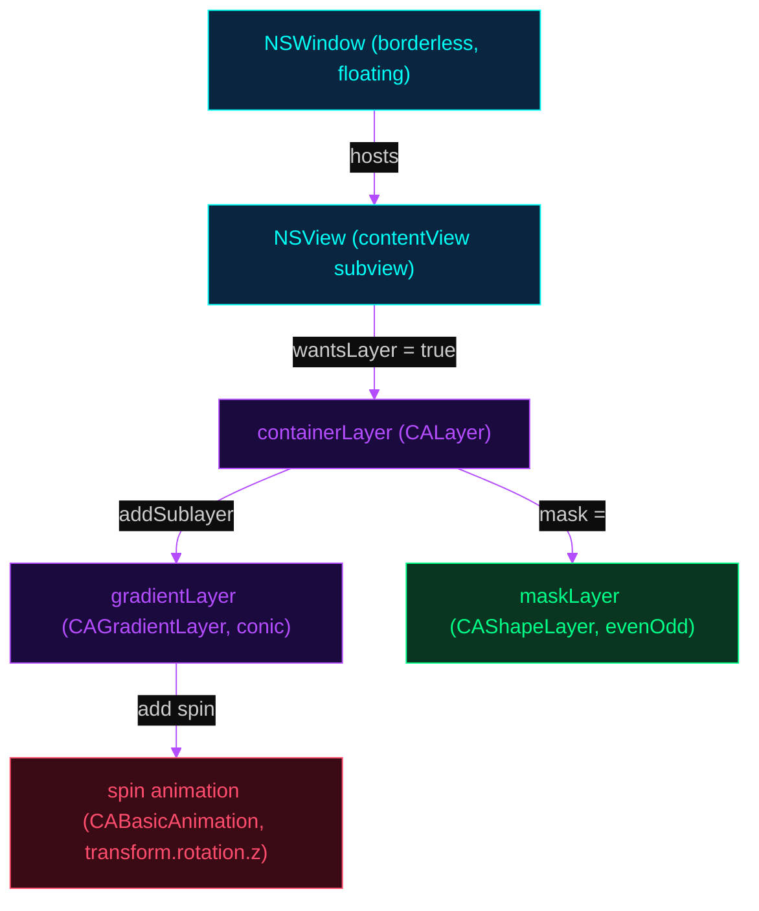
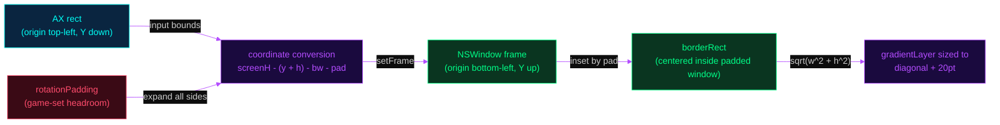
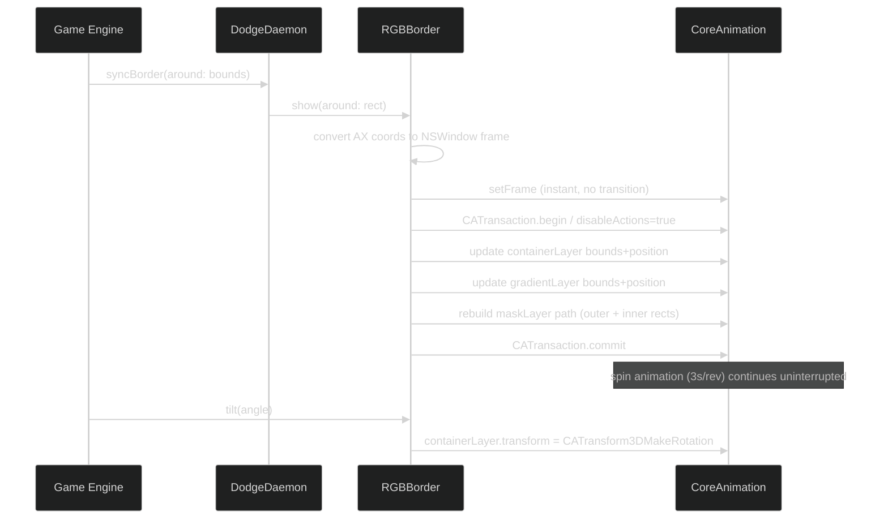
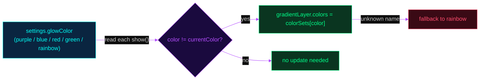
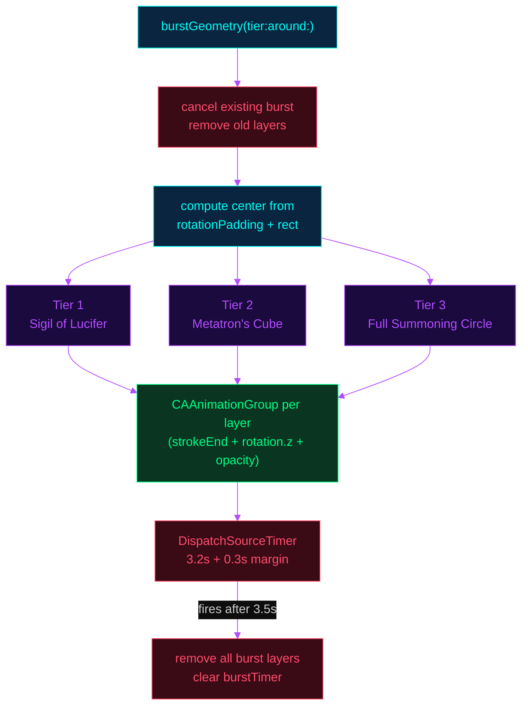
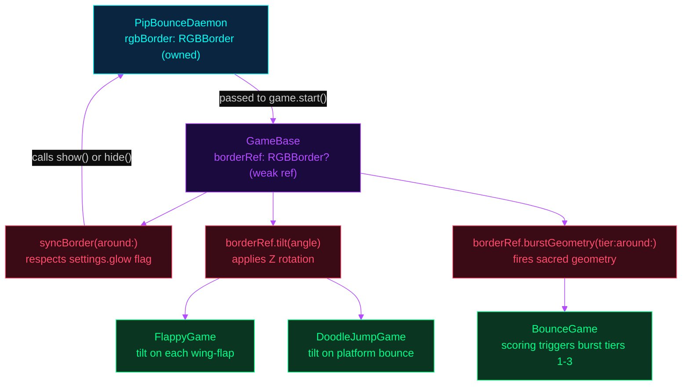

# RGB Border

The `RGBBorder` class renders the animated glow ring that surrounds the Picture-in-Picture window at all times during pipbounce operation. It is also responsible for the three-tier sacred geometry burst animations that fire during gameplay events such as scoring milestones. This document covers the layer architecture, coordinate system, animation pipeline, color system, and the full burst geometry implementation.

---

## Layer Architecture

`RGBBorder` composites three CoreAnimation layers to produce the glow ring. A transparent, borderless `NSWindow` floats above all other content at `.floating` window level. Inside it, a `containerLayer` holds position and rotation state. A `CAGradientLayer` of type `.conic` spins continuously at one revolution per three seconds, providing the color sweep. An even-odd fill-rule `CAShapeLayer` acts as a mask, cutting out the interior of the rounded rectangle so only a thin ring of gradient is visible.

The following diagram shows the complete layer hierarchy and how each component relates to the others.



The even-odd fill rule applied to `maskLayer` is the key rendering trick: two concentric rounded rectangles are added to a single `CGMutablePath`. CoreAnimation fills the region that is covered by an odd number of winding paths — the outer ring — while leaving the inner rectangle transparent. The gradient spins freely underneath, and only the annular ring region is ever shown to the user.

---

## Coordinate System and Window Sizing

macOS has two conflicting coordinate conventions that `RGBBorder` must bridge. The Accessibility framework reports PiP window bounds in **AX coordinates**: origin at the top-left of the screen, Y increasing downward. `NSWindow` frames use **Quartz/AppKit coordinates**: origin at the bottom-left, Y increasing upward. The `show(around:)` method performs this conversion on every update.

An optional `rotationPadding` property expands the window footprint symmetrically on all sides. Game modes that physically tilt the PiP window (Bounce, Flappy Bird, Doodle Jump) set this to approximately half the PiP diagonal so the rotating ring never clips outside the window bounds during rotation.



The gradient layer is deliberately sized to the full diagonal of the border rectangle plus a 20-point margin. This ensures that when the conic gradient rotates, the color sweep covers the entire ring perimeter without any visible gaps at the corners.

---

## Animation Pipeline

Three animation phases are always active when the border is visible. All layer geometry updates are wrapped in a `CATransaction` with `disableActions = true` to suppress CoreAnimation's implicit transition animations — this prevents the ring from visually sliding or fading when the PiP moves rapidly across the screen.



The `tilt()` method applies a Z-axis rotation to `containerLayer`. Because the gradient layer is a sublayer and the mask is applied to `containerLayer`, both rotate together as a unit. This is why `rotationPadding` must be set before `show()` is called: the padded window is large enough to contain the rotated ring at any angle without clipping.

---

## Color System

Five named color sets are defined as class-level constants. Each set is an array of `CGColor` values used as stops for the conic gradient. The first and last color in each array are identical so the gradient wraps seamlessly during continuous rotation.

| Name | Description | Primary stop |
|------|-------------|--------------|
| `purple` | Deep violet to hot pink sweep | `(0.7, 0.3, 1.0)` |
| `blue` | Ocean blue to sky cyan sweep | `(0.2, 0.5, 1.0)` |
| `red` | Crimson to coral sweep | `(1.0, 0.2, 0.2)` |
| `green` | Emerald to mint sweep | `(0.1, 0.9, 0.4)` |
| `rainbow` | Full ROYGBIV spectrum | — |

The color is read from `settings.glowColor` on every `show()` call and compared to `currentColor`. If the value has changed, `gradientLayer.colors` is updated. This allows the Chrome extension to change the glow color at runtime via the HTTP control server without restarting the animation.



---

## Sacred Geometry Burst System

When a gameplay event reaches a score threshold, the daemon calls `burstGeometry(tier:around:)`. This method creates a set of `CAShapeLayer` objects directly on the content view's root layer — layered above the spinning ring — animates them with stroke-draw, rotation, and fade sequences, then removes them after 3.5 seconds via a `DispatchSourceTimer`. Three tiers of increasing complexity are defined, each drawing a distinct occult geometric motif.

The burst layers use the same `rotationPadding`-adjusted center point so the sigil appears centered on the PiP window regardless of whether padding is active.



### Tier 1: Sigil of Lucifer

The first tier is triggered at low score thresholds. It renders a stylised version of the Sigil of Lucifer: an inverted V (the horns) with a horizontal crossbar, a diamond shape in the center, a vertical descending line, a double-barred cross at the bottom, and a faint binding circle. Key vertices are marked with small filled dots that appear sequentially with a stagger delay.

The sigil body is drawn as a single multi-subpath `CGMutablePath` using `strokeEnd` animation from 0 to 1 over 1.2 seconds. An inverted equilateral triangle is drawn in the alternate color at 50% opacity, counter-rotating at 0.5 revolutions over the burst duration.

### Tier 2: Metatron's Cube

The second tier draws Metatron's Cube: 13 circles arranged as one center, six on an inner ring, and six on an outer ring at `innerR * 2` radius. Every center is connected to every other center with faint lines (78 line segments total), producing the characteristic flower-of-life lattice. A unicursal hexagram — drawn in a single continuous stroke by visiting the six outer hexagram vertices in the Thelemic winding order `[0,2,4,0,3,5,1,4,2,5,3,1,0]` — overlays the cube at full brightness. Two overlapping equilateral triangles (Star of David) are rendered in the alternate color at the inner ring radius.

The hexagram spins one full revolution during the 3.2-second burst. The inner triangles counter-rotate one full revolution in the opposite direction.

### Tier 3: Full Summoning Circle

The third tier is the most complex, reserved for major score events. It composes seven distinct motifs with staggered animation timing.

```mermaid
%%{init: {'theme': 'dark', 'themeVariables': {'primaryColor': '#0a2540', 'primaryTextColor': '#00fff5', 'primaryBorderColor': '#00fff5', 'lineColor': '#b44dff', 'edgeLabelBackground': '#0d0d0d', 'clusterBkg': '#0d0d0d', 'titleColor': '#00fff5'}}}%%
gantt
    title Tier 3 Burst — Animation Timeline (duration = 3.2s)
    dateFormat  X
    axisFormat %ss

    section Rings
    Triple binding rings (fade-only)        :0, 3200
    Rune tick marks (fade-only)             :0, 3200

    section Pentagram
    Inverted pentagram (draw + 1.5 rev spin):0, 3200

    section Inner Geometry
    8-point chaos star (draw + -2 rev spin) :300, 3200
    Leviathan cross (scale-in from 0)       :500, 3200
    All-seeing eye (scale-in from 0)        :800, 3200

    section Fragments
    Cardinal sigil fragments (fade-only)    :0, 3200
```



The **triple binding rings** are three concentric circles at radii `r`, `r * 0.88`, and `r * 0.76`, drawn in the dim color at decreasing opacity (0.5, 0.35, 0.25). They appear immediately and fade out in the final 28% of the animation.

The **rune tick marks** are 36 radial line segments evenly distributed at 10-degree intervals between the outer two rings. Every ninth mark (the four cardinal directions) is extended inward for emphasis.

The **inverted pentagram** connects five vertices in star order (`0→2→4→1→3→0`) at 72% of the burst radius. The rotation offset places the first vertex pointing downward. It draws over 1.2 seconds while rotating 1.5 revolutions.

The **8-pointed chaos star** overlays two squares rotated 45 degrees relative to each other at 38% of the burst radius. It counter-rotates two full revolutions.

The **Leviathan cross** consists of a vertical line, upper crossbar, lower crossbar, and an infinity symbol (two tangent arcs) at the base. It scales in from zero over 0.6 seconds starting at t=0.5s.

The **all-seeing eye** is a small equilateral triangle with an eye formed by two opposing arcs and a filled iris ellipse. It scales in from zero at t=0.8s.

The **cardinal sigil fragments** are four small inverted V-shapes with a dot below, positioned at the four cardinal angles at 58% of the burst radius, rendered in the dim color at 50% opacity.

---

## Integration with the Game Engine

`RGBBorder` is owned by `PipBounceDaemon` as a single long-lived instance. During game mode, the instance is passed by reference into the active `MiniGame` subclass via `GameBase.start(screen:pip:border:)`. The base class stores it as `borderRef` and exposes three helper methods used by all game subclasses.



`syncBorder(around:)` is the standard per-tick update call. It checks `settings.glow` before calling `show()`, so the border respects the user's toggle preference without requiring individual game implementations to check the flag themselves. When a game stops, `GameBase.stop()` resets `rotationPadding` to zero, resets `tilt` to identity, and calls `hide()` before releasing the reference.

---

## Public API Summary

```swift
// Position the border ring around an AX-coordinate rect.
// Creates the NSWindow on first call; subsequent calls update geometry.
func show(around rect: CGRect)

// Rotate the entire border ring by angle (radians) around the Z axis.
// Pass 0 to reset to identity. Used by tilt-physics game modes.
func tilt(_ angle: CGFloat)

// Fire a sacred geometry burst animation around the current border position.
// tier 1 = Sigil of Lucifer, tier 2 = Metatron's Cube, tier 3 = Full Summoning Circle
// Cleans up automatically after ~3.5 seconds.
func burstGeometry(tier: Int, around rect: CGRect)

// Hide the border window and cancel any in-progress burst animation.
// Releases the NSWindow; next show() call rebuilds it from scratch.
func hide()

// Extra padding (points) added symmetrically around the border rect.
// Set before show() in game modes that apply rotation transforms.
var rotationPadding: CGFloat
```

---

## Path Helper Reference

Two private helpers generate the geometric primitives used by the burst tiers.

**`addPolygon(to:sides:radius:center:rotation:)`** generates a regular N-gon. The default `rotation` of `-π/2` places the first vertex at the top (twelve o'clock). Passing `π/2` inverts this to place the first vertex at the bottom, producing point-down pentagrams and inverted triangles.

**`addUnicursalHexagram(to:radius:center:)`** implements the Thelemic unicursal hexagram as a single closed polyline. The winding order `[0,2,4,0,3,5,1,4,2,5,3,1,0]` visits all six outer vertices in a sequence that produces the characteristic interlocked-triangle shape without lifting the pen, enabling stroke-draw animation to trace the complete figure in one continuous motion.
